# Dimensionality reduction {#dimensionality-reduction}

In machine learning, dimensionality reduction refers broadly to any modelling approach that reduces the number of variables in a dataset to a few highly informative or representative ones (Figure \@ref(fig:dimreduc)). This is necessitated by the fact that large datasets with many variables are inherently difficult for humans to develop a clear intuition for. Dimensionality reduction is therefore an integral step in the analysis of large, complex (biological) datasets, allowing exploratory analyses and more intuitive visualisation that may aid interpretability, as well as forming a chain in the link of more complex analyses.

<div class="figure" style="text-align: center">

<p class="caption">Example of a dimensionality reduction. Here we have a two-dimensional dataset embeded in a three-dimensional space (swiss roll dataset).</p>
</div>

In biological applications, systems-level measurements are typically used to decipher complex mechanisms. These include measurements of gene expression from collections of microarrays [@Breeze873,@windram2012arabidopsis,@Lewis15,@Bechtold] or RNA-sequencing experiments [@irie2015sox17,@tang2015unique] that provide quantitative measurments for tens-of-thousands of genes. Studies like these, based on bulk measurements (that is pooled material), provide observations for many variables (in this case many genes) but with relatively few samples e.g., few time points or conditions. The imbalance between the number of variables and the number of observations is referred to as large *p*, small *n*, and makes statistical analysis difficult. Dimensionality reduction techniques therefore prove to be a useful first step in any analysis, identifying potential structure that exists in the dataset or highlighting which (combinations of) variables are the most informative.

The increasing prevalence of single cell RNA-sequencing (scRNA-seq) means the scale of datasets has shifted away from large *p*, small *n*, towards providing measurements of many variables but with a corresponding large number of observations (large *n*) albeit from potentially heterogeneous populations. scRNA-sequencing was largely driven by the need to investigate the transcrptomes of cells that were limited in quantity, such as embryonic cells, with early applications in mouse blastomeres [@tang2009mrna]. As of 2017, scRNA-seq experiments routinely generate datasets with tens to hundreds-of-thousands of cells (see e.g., [@svensson2017moore]). Indeed, in 2016, the [10x Genomics million cell experiment](https://community.10xgenomics.com/t5/10x-Blog/Our-1-3-million-single-cell-dataset-is-ready-to-download/ba-p/276) provided sequencing for over 1.3 million cells taken from the cortex, hippocampus and ventricular zone of embryonic mice, and large international consortiums, such as the [Human Cell Atlas](https://www.humancellatlas.org) aim to create a comprehensive maps of all cell types in the human body. A key goal when dealing with datasets of this magnitude is the identification of subpopulations of cells that may have gone undetected in bulk experiments; another, perhaps more ambitious task, aims to take advantage of any heterogeneity within the population in order to identify a temporal or mechanistic progression of developmental processes or disease.

Of course, whilst dimensionality reduction allows humans to inspect the dataset manually, particularly when the data can be represented in two or three dimensions, we should keep in mind that humans are exceptionally good at identifying patterns in two or three dimensional data, even when no real structure exists (Figure \@ref(fig:humanpattern). It is therefore useful to employ other statistical approaches to search for patterns in the reduced dimensional space. In this sense, dimensionality reduction forms an integral component in the analysis of complex datasets that will typically be combined a variety of machine learning techniques, such as classification, regression, and clustering.

<div class="figure" style="text-align: center">

<p class="caption">Humans are exceptionally good at identifying patterns in two and three-dimensional spaces - sometimes too good. To illustrate this, note the Great Britain shapped cloud in the image (presumably drifting away from an EU shaped cloud, not shown). More whimsical shaped clouds can also be seen if you have a spare afternoon.  Golcar Matt/Weatherwatchers [BBC News](http://www.bbc.co.uk/news/uk-england-leeds-40287817)</p>
</div>

In this chapter we will explore two forms of dimensionality reduction: principle component analysis ([PCA](#linear-dimensionality-reduction)) and t-distributed stochastic neighbour embedding ([tSNE](#nonlinear-dimensionality-reduction)), highlighting the advantages and potential pitfalls of each method. As an illustrative example, we will use these approaches to analyse single cell RNA-sequencing data of early human development. Finally, we will illustrate the use of dimensionality redution on an image dataset.

## Linear Dimensionality Reduction {#linear-dimensionality-reduction}

The most widely used form of dimensionality reduction is principle component analysis (PCA), which was introduced by Pearson in the early 1900's [@pearson1901liii], and independently rediscovered by Hotelling [@hotelling1933analysis]. PCA has a long history of use in biological and ecological applications, with early use in population studies [@sforza1964analysis], and later for the analysis of gene expression data [@vohradsky1997identification,@craig1997developmental,@hilsenbeck1999statistical].

PCA is not a dimensionality reduction technique *per se*, but an alternative way of representing the data that more naturally captures the variance in the system. Specifically, it finds a new co-ordinate system, so that the new "x-axis" (which is called the first principle component; PC1) is aligned along the direction of greatest variance, with an orthogonal "y-axis" aligned along the direction with second greatest variance (the second principle component; PC2), and so forth. At this stage there has been no inherent reduction in the dimensionality of the system, we have simply rotated the data around.

To illustrate PCA we can repeat the analysis of [@ringner2008principal] using the dataset of [@saal2007poor] (GEO GSE5325). This dataset contains gene expression profiles for $105$ breast tumour samples measured using Swegene Human 27K RAP UniGene188 arrays. Within the population of cells, [@ringner2008principal] focused on the expression of *GATA3* and *XBP1*, whose expression was known to correlate with estrogen receptor status [^](Breast cancer cells may be estrogen receptor positive, ER$^+$, or negative, ER$^-$, indicating capacity to respond to estrogen signalling, which has impliations for treatment), representing a two dimensional system. A pre-processed dataset containing the expression levels for *GATA3* and *XBP1*, and ER status, can be loaded into R using the code, below:


```r
D <- read.csv(file = "data/GSE5325/GSE5325_markers.csv", header = TRUE, sep = ",", row.names=1)
```

For illustration purposes we've also included 3 additional variables that have been generated as independent random samples from a univariate normal distribution. We thus have a a $5$ dimensional system, with $x$ and $y$ representing the expression levels of *GATA3* and *XBP1* (rows 1 and 2). For convenience we also have the ER status, which we will not use directly, but simply as a visual readout of our appraoch. We start by plotting *GATA3* expression versus *XBP1*, and color by ER status:


```r
plot(t(D[1,which(D[6,]==0)]),t(D[2,which(D[6,]==0)]),'p',col='red', ylab="XBP1", xlab="GATA3",xlim=c(min(D[2,],na.rm = TRUE), max(D[2,],na.rm = TRUE)),ylim=c(min(D[1,],na.rm = TRUE), max(D[1,],na.rm = TRUE)))
points(t(D[1,which(D[6,]==1)]),t(D[2,which(D[6,]==1)]),'p',col='blue')
```

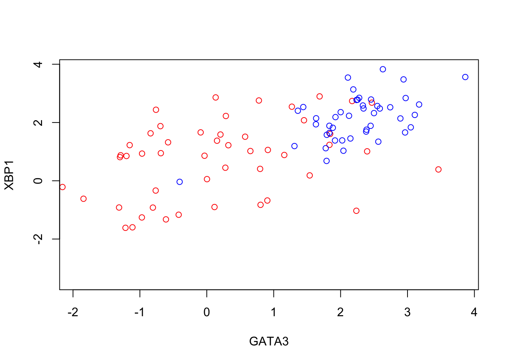

As this system is inherently low dimensional we can clearly see that ER status correlates with both *GATA3* and *XBP1* expression. We perform PCA in R using the \texttt{prcomp} function. To do so, we first filter out datapoints that have missing observations, as PCA does not, inherently, deal with missing observations. We will now run PCA using just the first two dimensions to understand what's going on:


```r
Dommitsamps <- t(na.omit(t(D[,]))); #Get the subset of samples

pca1  <- prcomp(t(Dommitsamps[1:2,]), center = TRUE, scale=FALSE)
ERexp <- Dommitsamps[6,];

ER_neg <- pca1$x[which(ERexp==0),]
ER_pos <- pca1$x[which(ERexp==1),]

plot(ER_neg[,1],ER_neg[,2],'p',col='red', xlab="PC1", ylab="PC2",xlim=c(-4.5, 4.2),ylim=c(-3, 2.5))
points(ER_pos[,1],ER_pos[,2],'p',col='blue')
```

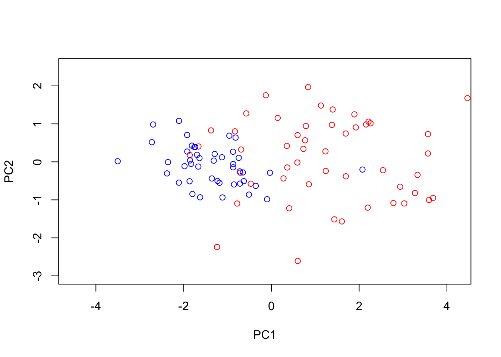

Note that the \texttt{prcomp} has the option to centre and scale the data. That is, to normalise each variable to have a zero-mean and unit variance. This is particularly important when dealing with variables that may exist over very different scales. For example, for ecological datasets we may have variables that were measured in seconds with others measured in hours. Without normalisation there would appear to be much greater variance in the variable measured in seconds, potentially skewing the results. In general, when dealing with variables that are measured on similar scales (for example gene expression) it is not desirable to normalise the data.

We can better visualise what the PCA has done by plotting the original data side-by-side with the transformed data (note that here we have plotted the negative of PC1).


```r
par(mfrow=c(1,2))
plot(t(D[1,which(D[6,]==0)]),t(D[2,which(D[6,]==0)]),'p',col='red', ylab="XBP1", xlab="GATA3",xlim=c(min(D[2,],na.rm = TRUE), max(D[2,],na.rm = TRUE)),ylim=c(min(D[1,],na.rm = TRUE), max(D[1,],na.rm = TRUE)))
points(t(D[1,which(D[6,]==1)]),t(D[2,which(D[6,]==1)]),'p',col='blue')
plot(-ER_neg[,1],ER_neg[,2],'p',col='red', xlab="-PC1", ylab="PC2",xlim=c(-4.5, 4.2),ylim=c(-3, 2.5))
points(-ER_pos[,1],ER_pos[,2],'p',col='blue')
```

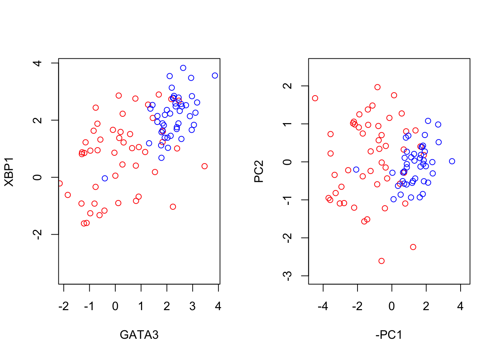

We can seen that we have simply rotated the original data, so that the greatest variance aligns along the x-axis and so forth. We can find out how much of the variance each of the principle components explains by looking at \texttt{pca1$sdev}:


```r
par(mfrow=c(1,1))
barplot(((pca1$sdev)^2 / sum(pca1$sdev^2))*100, names.arg=c("PC1","PC2"), ylab="% variance")
```

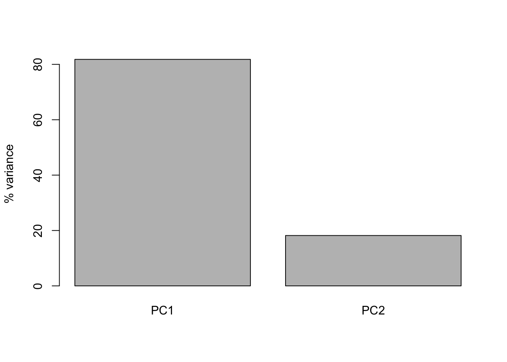

PC1 explains the vast majority of the variance in the observations. The dimensionality reduction step of PCA occurs when we choose to discard the higher PCs. Of course, by doing so we loose some information about the system, but this may be an acceptable loss compared to the increased interpretability achieved by visualising the system in lower dimensions. In the example from [@ringner2008principal] we can visualise the data using only PC1.


```r
par(mfrow=c(1,1))
plot(-ER_neg[,1],matrix(-1, 1, length(ER_neg[,1])),'p',col='red', xlab="PC1",xlim=c(-4, 3),ylim=c(-1.5,1.5),yaxt="n", ylab="")
points(-ER_pos[,1],matrix(-1, 1, length(ER_pos[,1])),'p',col='blue')
points(-ER_neg[,1],matrix(1, 1, length(ER_neg[,1])),'p',col='red', xlab="PC1",xlim=c(-4, 3))
points(-ER_pos[,1],matrix(0, 1, length(ER_pos[,1])),'p',col='blue')
axis(side = 2, at = seq(-1, 1, by = 1), labels = c("All","ER-","ER+"))
```

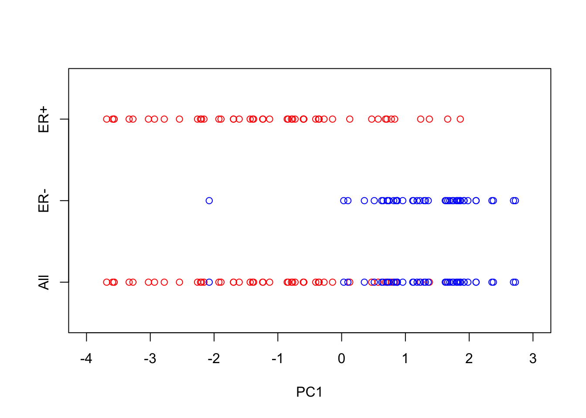

So reducing the system down to one dimension appears to have done a good job at separating out the ER$^+$ cells from the ER$^-$ cells, suggesting that it may be of biological use. Precisely how many PCs to retain remains subjective. For visualisation purposed, it is typical to look at the first two or three only. However, when using PCA as an intermediate step within more complex workflows, more PCs are often retained e.g., by thresholding to a suitable level of explanatory variance.

### Interpreting the Principle Component Axes

In the original data, the individual axes had very obvious interpretations: the x-axis represented expression levels of *GATA3* and the y-axis represented the expression level of *XBP1*. Other than indicating maximum variance, what does PC1 mean? The individual axes represent linear combinations of the expression of various genes. This may not be immediately intuitive, but we can get a feel by projecting the original axes (gene expression) onto the (reduced dimensional) co-ordinate system.


```r
genenames <- c("GATA3","XBP1")
plot(-pca1$rotation[,1],pca1$rotation[,2], type="n", xlim=c(-2, 2), ylim=c(-2, 2), xlab="PC1", ylab="PC2")
text(-pca1$rotation[,1], pca1$rotation[,2], genenames, cex = .4)
arrows(0, 0, x1 = -pca1$rotation[,1], y1 = -pca1$rotation[,2],length=0.1)
```

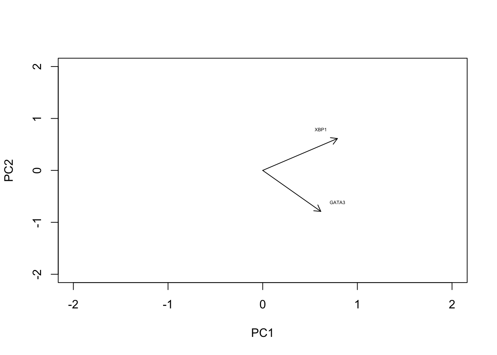

In this particular case, we can see that both genes appear to be reasonably strongly associated with PC1. When dealing with much larger systems e.g., with more genes, we can, of course, project the original axes into the reduced dimensional space. In general this is particularly useful for identifying genes associated with particular PCs, and ultimately assigning a biological interpretation to the PCs.

Excercise: Try doing a PCA again, this time including all variables. What are the key features of the dataset?

### Horseshoe effect

Principle component analysis is a linear dimensionality reduction technique, and is not always appropriate for complex datasets, particularly when dealing with nonlinearities. To illustrate this, let's consider an simulated expression set containing $8$ genes, with $10$ timepoints/conditions. We can represent this dataset in terms of a matrix: 


```r
X <- matrix( c(2,4,2,0,0,0,0,0,0,0,
                 0,2,4,2,0,0,0,0,0,0,
                 0,0,2,4,2,0,0,0,0,0,  
                 0,0,0,2,4,2,0,0,0,0,   
                 0,0,0,0,2,4,2,0,0,0,    
                 0,0,0,0,0,2,4,2,0,0,   
                 0,0,0,0,0,0,2,4,2,0,  
                 0,0,0,0,0,0,0,2,4,2), nrow=8,  ncol=10, byrow = TRUE)
```

Or we can visualise by plotting a few of the genes:


```r
plot(1:10,X[1,],type="l",col="red",xlim=c(0, 14),xlab="Time",ylab="Expression")
points(1:10,X[2,],type="l",col="blue")
points(1:10,X[5,],type="l",col="black")
legend(8, 4, legend=c("gene 1", "gene 2", "gene 5"), col=c("red", "blue", "black"),lty=1, cex=0.8)
```

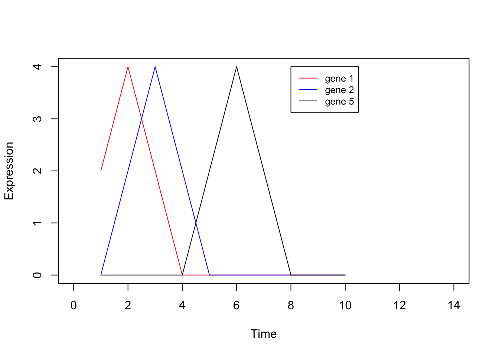

By eye, we see that the data can be separated out by a single direction: that is, we can order the data from time/condition 1 through to time/condition 10. Intuitively, then, the data can be represented by a single dimension. Let's run PCA as we would normally, and visualise the result, plotting the first two PCs:


```r
pca2 <- prcomp((X),center = TRUE,scale=FALSE)
condnames = c('G1','G2','G3','G4','G5','G6','G7','G8')
plot(pca2$x[,1:2],type="p",col="red",xlim=c(-5, 5),ylim=c(-5, 5))
text(pca2$x[,1:2]+0.5, condnames, cex = 0.7)
```

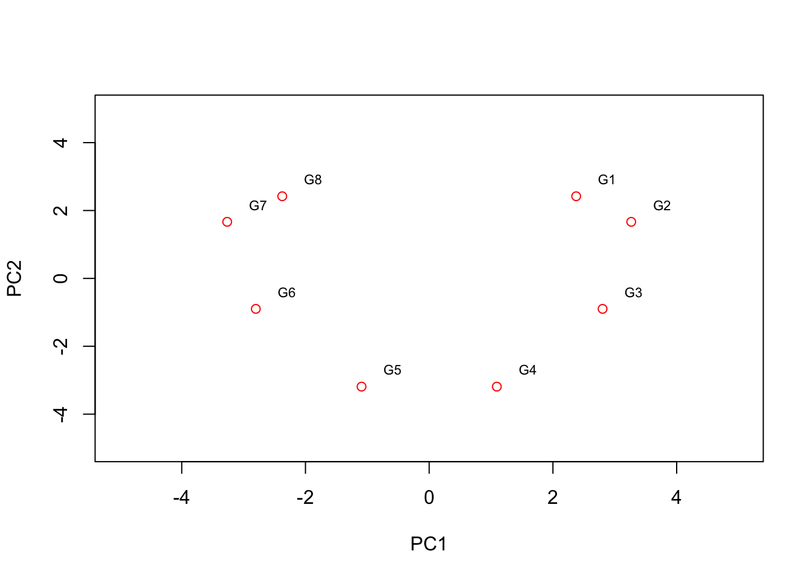

We see that the PCA plot has placed the datapoints in a horseshoe shape, with gene 1 becoming closer to gene 8. From the earlier plots of gene expression profiles we can see that the relationships between the various genes are not entirely straightforward. For example, gene 1 is initially correlated with gene 2, then negatively correlated, and finally uncorrelated, whilst no correlation exists between gene 1 and genes 5 - 8. These nonlinearities make it difficult for PCA which, in general, attempts to preserve large pairwise distances, leading to the well known horseshoe effect [@novembre2008interpreting,@reich2008principal]. These types of artefacts may be problematic when trying to interpret data, and due care must be given when these type of effects are seen.

### PCA analysis of mammalian development

Now that we have a feel for PCA and understand some of the basic commands we can apply it in a real setting. Here we will make use of preprocessed data taken from [@yan2013single] (GEO  GSE36552) and [@guo2015transcriptome] (GEO GSE63818). The data from [@yan2013single] represents single cell RNA-seq measurements from human embryos from the zygote stage (a single cell produced following fertilisation of an egg) through to the blastocyst stage (an embryo consisting of around 64 cells), as well as human embryonic stem cells (hESC; cells extracted from an early blsatocyst stage embryo and maintained *in vitro*). The dataset of [@guo2015transcriptome] contains scRNA-seq data from human primordial germ cells (hPGCs), precursors of sperm or eggs that are specified early in the developing human embryo soon after implantation (around week 2-3 in humans), and somatic cells. Together, these datasets provide useful insights into early human development, and possible mechanisms for the specification of early cell types, such as PGCs. 

<div class="figure" style="text-align: center">

<p class="caption">Example of early human development. Here we have measurements of cells from preimplantation embryos, embryonic stem cells, and from post-implantation primordial germ cells and somatic tissues.</p>
</div>

Preprocessed data contains $\log_2$ normalised counts for around $400$ cells using $2957$ marker genes can be found in the file \texttt{/data/PGC_transcriptomics/PGC_transcriptomics.csv}. Note that the first line of data in the file is an indicator denoting cell type (-1 = ESC, 0 = pre-implantation, 1 = PGC, and 2 = somatic cell). The second row indicates the sex of the cell (0 = unknown/unlabelled, 1 = XX, 2 = XY), with the third row indicating capture time (-1 = ESC, 0 - 7 denotes various developmental stages from zygote to blastocyst, 8 - 13 indicates increasing times of embryo development from week 4 through to week 19).

We will first run PCA on the data. Recall that the data is already log_2 normalised, with expression values beginning from row 4. Within R we would run:


```r
set.seed(12345)
D <- read.csv(file = "data/PGC_transcriptomics/PGC_transcriptomics.csv", header = TRUE, sep = ",", row.names=1)
genenames <- rownames(D)
genenames <- genenames[4:nrow(D)]
pcaresult <- prcomp(t(D[4:nrow(D),1:ncol(D)]), center = TRUE, scale = FALSE)
```

Here we have opted to centre the data, but have not normalised each gene to be zero-mean. This is beacuse we are dealing entirely with gene expression, rather than a variety of variables that may exist on different scales. 

We can extract the positions of individual cells from the \texttt{pcaresult$x} variable. In the snippet, below, we index the different cells types (ESC, pre-implantation cells, primordial germ cells and somatic cells) for easier plotting. 


```r
y1 <- pcaresult$x[which(D[1,]==-1),1:2] # PCA
y2 <- pcaresult$x[which(D[1,]==0),1:2]  #
y3 <- pcaresult$x[which(D[1,]==1),1:2]  #
y4 <- pcaresult$x[which(D[1,]==2),1:2]  #
```

Finally, we can plot the data as follows:


```r
plot(y1,type="p",col="red",xlim=c(-100, 100),ylim=c(-50, 50))
points(y2,type="p",col="black")
points(y3,type="p",col="blue")
points(y4,type="p",col="green")
legend(-95, 50, legend=c("ESC", "preimp", "PGC", "soma"), col=c("red", "black", "blue", "green"), pch="o", bty="n", cex=0.8)
```

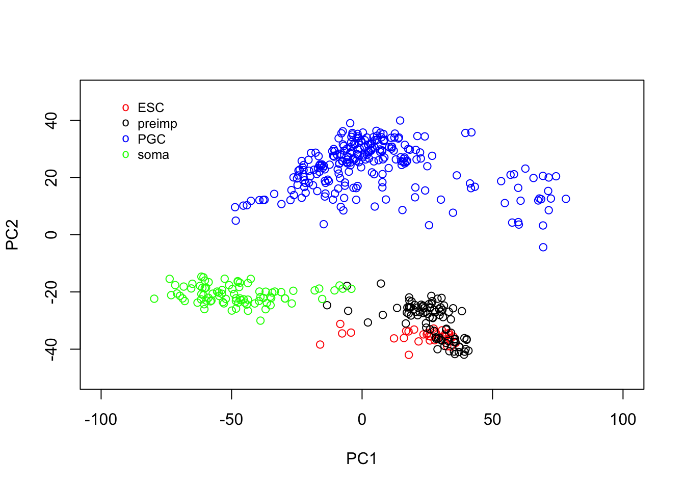

From the plot, we can see PCA has done a reasonable job of separating out various cells. For example, a cluster of PGCs appears at the top of the plot, with somatic cells towards the lower right hand side. Pre-implantation embryos and ESCs appear to cluster together: perhaps this is not surprising as ESCs are derived from blastocyst cells. Loosely, we can interpret PC1 as dividing pre-implantation cells from somatic cells, with PC2 separating out PGCs.

Previously we used PCA to reduce the dimensionality of our data from thousands of genes down to two principle components. By eye, PCA appeared to do a reasonable job separating out different cell types. A useful next step might therefore be to perform clustering on the reduced dimensional space. We will go into more details about clusterin in subsequent sections, but for now we will simply use clustering as a tool for seperating out our datasets. We can run k-means clustering on a matrix using:


```r
clust <- kmeans(pcaresult$x[,1:2], 4, iter.max = 1000)
```

We can now compare the cluster assignment to the known cell types:


```r
Labels <- vector("character", ncol(D))
Labels[which(D[1,]==-1)] = "ESC"
Labels[which(D[1,]==0)] = "preimp"
Labels[which(D[1,]==1)] = "PGC"
Labels[which(D[1,]==2)] = "soma"

clusterresults <- rbind(Labels,clust$cluster)
```

We note that, in general PGCs fall into one or more separate clusters, with soma also separating out well. ESCs and pre-implantation tend to fall into identical clusters. We can take a look at what cell types fall into a specific cluster:


```r
clusterresults[1,which(clusterresults[2,]==1)]
```

```
##     PGC   PGC.1   PGC.2   PGC.3   PGC.4   PGC.5   PGC.6   PGC.7   PGC.8 
##   "PGC"   "PGC"   "PGC"   "PGC"   "PGC"   "PGC"   "PGC"   "PGC"   "PGC" 
##   PGC.9  PGC.10  PGC.11  PGC.12  PGC.13  PGC.14  PGC.15  PGC.16  PGC.17 
##   "PGC"   "PGC"   "PGC"   "PGC"   "PGC"   "PGC"   "PGC"   "PGC"   "PGC" 
##  PGC.18  PGC.19  PGC.20  PGC.21  PGC.22  PGC.23  PGC.24  PGC.25  PGC.26 
##   "PGC"   "PGC"   "PGC"   "PGC"   "PGC"   "PGC"   "PGC"   "PGC"   "PGC" 
##  PGC.27  PGC.28  PGC.29  PGC.30  PGC.31  PGC.32  PGC.33  PGC.34  PGC.35 
##   "PGC"   "PGC"   "PGC"   "PGC"   "PGC"   "PGC"   "PGC"   "PGC"   "PGC" 
##  PGC.36  PGC.37  PGC.38  PGC.39  PGC.40  PGC.41  PGC.42  PGC.43  PGC.44 
##   "PGC"   "PGC"   "PGC"   "PGC"   "PGC"   "PGC"   "PGC"   "PGC"   "PGC" 
##  PGC.45  PGC.46  PGC.47  PGC.48  PGC.49  PGC.50  PGC.51  PGC.52  PGC.53 
##   "PGC"   "PGC"   "PGC"   "PGC"   "PGC"   "PGC"   "PGC"   "PGC"   "PGC" 
##  PGC.54  PGC.55  PGC.56  PGC.57  PGC.58  PGC.59  PGC.60  PGC.61  PGC.62 
##   "PGC"   "PGC"   "PGC"   "PGC"   "PGC"   "PGC"   "PGC"   "PGC"   "PGC" 
##  PGC.63  PGC.64  PGC.65  PGC.66  PGC.67  PGC.68  PGC.69  PGC.70  PGC.71 
##   "PGC"   "PGC"   "PGC"   "PGC"   "PGC"   "PGC"   "PGC"   "PGC"   "PGC" 
##  PGC.72  PGC.73  PGC.74  PGC.75  PGC.76  PGC.77  PGC.78  PGC.79  PGC.80 
##   "PGC"   "PGC"   "PGC"   "PGC"   "PGC"   "PGC"   "PGC"   "PGC"   "PGC" 
##  PGC.81  PGC.82  PGC.83  PGC.84  PGC.85  PGC.86  PGC.87  PGC.88  PGC.89 
##   "PGC"   "PGC"   "PGC"   "PGC"   "PGC"   "PGC"   "PGC"   "PGC"   "PGC" 
##  PGC.90  PGC.91  PGC.92  PGC.93  PGC.94  PGC.95  PGC.96  PGC.97  PGC.98 
##   "PGC"   "PGC"   "PGC"   "PGC"   "PGC"   "PGC"   "PGC"   "PGC"   "PGC" 
##  PGC.99 PGC.100 PGC.101 PGC.102 PGC.103 PGC.104 PGC.105 PGC.106 PGC.107 
##   "PGC"   "PGC"   "PGC"   "PGC"   "PGC"   "PGC"   "PGC"   "PGC"   "PGC" 
## PGC.108 PGC.109 PGC.110 PGC.111 PGC.112 PGC.113 PGC.114 PGC.115 PGC.116 
##   "PGC"   "PGC"   "PGC"   "PGC"   "PGC"   "PGC"   "PGC"   "PGC"   "PGC" 
## PGC.117 PGC.118 PGC.119 PGC.120 PGC.121 PGC.122 PGC.123 PGC.124 PGC.125 
##   "PGC"   "PGC"   "PGC"   "PGC"   "PGC"   "PGC"   "PGC"   "PGC"   "PGC" 
## PGC.126 PGC.127 PGC.128 PGC.129 PGC.130 PGC.131 PGC.132 PGC.133 PGC.134 
##   "PGC"   "PGC"   "PGC"   "PGC"   "PGC"   "PGC"   "PGC"   "PGC"   "PGC" 
## PGC.135 PGC.136 PGC.137 PGC.138 PGC.139 PGC.140 PGC.141 PGC.142 PGC.143 
##   "PGC"   "PGC"   "PGC"   "PGC"   "PGC"   "PGC"   "PGC"   "PGC"   "PGC" 
## PGC.144 PGC.146 PGC.147 PGC.148 PGC.149 PGC.150 PGC.151 PGC.152 PGC.153 
##   "PGC"   "PGC"   "PGC"   "PGC"   "PGC"   "PGC"   "PGC"   "PGC"   "PGC" 
## PGC.154 PGC.155 PGC.156 PGC.157 PGC.158 PGC.159 PGC.160 PGC.161 PGC.162 
##   "PGC"   "PGC"   "PGC"   "PGC"   "PGC"   "PGC"   "PGC"   "PGC"   "PGC" 
## PGC.163 PGC.164 PGC.165 PGC.166 PGC.167 PGC.168 PGC.169 PGC.170 PGC.171 
##   "PGC"   "PGC"   "PGC"   "PGC"   "PGC"   "PGC"   "PGC"   "PGC"   "PGC" 
## PGC.172 PGC.173 PGC.174 PGC.175 PGC.176 PGC.177 PGC.178 PGC.179 PGC.180 
##   "PGC"   "PGC"   "PGC"   "PGC"   "PGC"   "PGC"   "PGC"   "PGC"   "PGC" 
## PGC.181 PGC.182 PGC.183 PGC.184 PGC.185 PGC.186 PGC.187 PGC.188 PGC.189 
##   "PGC"   "PGC"   "PGC"   "PGC"   "PGC"   "PGC"   "PGC"   "PGC"   "PGC" 
## PGC.190 PGC.191 PGC.195 PGC.198 PGC.205 PGC.207 PGC.217 PGC.231 PGC.233 
##   "PGC"   "PGC"   "PGC"   "PGC"   "PGC"   "PGC"   "PGC"   "PGC"   "PGC" 
## PGC.234 PGC.235 PGC.236 PGC.237 PGC.238 PGC.239 PGC.240 PGC.241 
##   "PGC"   "PGC"   "PGC"   "PGC"   "PGC"   "PGC"   "PGC"   "PGC"
```

```r
clusterresults[1,which(clusterresults[2,]==2)]
```

```
## preimp.46 preimp.51 preimp.82 preimp.87    ESC.16    ESC.18    ESC.31 
##  "preimp"  "preimp"  "preimp"  "preimp"     "ESC"     "ESC"     "ESC" 
##    ESC.33    soma.3    soma.4    soma.6    soma.8   soma.12   soma.13 
##     "ESC"    "soma"    "soma"    "soma"    "soma"    "soma"    "soma" 
##   soma.14   soma.15   soma.20   soma.23   soma.25   soma.27   soma.48 
##    "soma"    "soma"    "soma"    "soma"    "soma"    "soma"    "soma" 
##   soma.49   soma.50   soma.51   soma.52   soma.53   soma.54   soma.58 
##    "soma"    "soma"    "soma"    "soma"    "soma"    "soma"    "soma" 
##   soma.70   soma.81 
##    "soma"    "soma"
```

```r
clusterresults[1,which(clusterresults[2,]==3)]
```

```
##    preimp  preimp.1  preimp.2  preimp.3  preimp.4  preimp.5  preimp.6 
##  "preimp"  "preimp"  "preimp"  "preimp"  "preimp"  "preimp"  "preimp" 
##  preimp.7  preimp.8  preimp.9 preimp.10 preimp.11       ESC     ESC.1 
##  "preimp"  "preimp"  "preimp"  "preimp"  "preimp"     "ESC"     "ESC" 
## preimp.12 preimp.13 preimp.14 preimp.15 preimp.16 preimp.17 preimp.18 
##  "preimp"  "preimp"  "preimp"  "preimp"  "preimp"  "preimp"  "preimp" 
## preimp.19 preimp.20 preimp.21 preimp.22 preimp.23 preimp.24 preimp.25 
##  "preimp"  "preimp"  "preimp"  "preimp"  "preimp"  "preimp"  "preimp" 
## preimp.26 preimp.27 preimp.28 preimp.29 preimp.30 preimp.31 preimp.32 
##  "preimp"  "preimp"  "preimp"  "preimp"  "preimp"  "preimp"  "preimp" 
## preimp.33 preimp.34 preimp.35 preimp.36 preimp.37 preimp.38 preimp.39 
##  "preimp"  "preimp"  "preimp"  "preimp"  "preimp"  "preimp"  "preimp" 
## preimp.40 preimp.41 preimp.42 preimp.43 preimp.44 preimp.45 preimp.47 
##  "preimp"  "preimp"  "preimp"  "preimp"  "preimp"  "preimp"  "preimp" 
## preimp.48 preimp.49 preimp.50 preimp.52 preimp.53 preimp.54 preimp.55 
##  "preimp"  "preimp"  "preimp"  "preimp"  "preimp"  "preimp"  "preimp" 
## preimp.56 preimp.57 preimp.58 preimp.59 preimp.60 preimp.61 preimp.62 
##  "preimp"  "preimp"  "preimp"  "preimp"  "preimp"  "preimp"  "preimp" 
## preimp.63 preimp.64 preimp.65 preimp.66 preimp.67 preimp.68 preimp.69 
##  "preimp"  "preimp"  "preimp"  "preimp"  "preimp"  "preimp"  "preimp" 
## preimp.70 preimp.71 preimp.72 preimp.73 preimp.74 preimp.75 preimp.76 
##  "preimp"  "preimp"  "preimp"  "preimp"  "preimp"  "preimp"  "preimp" 
## preimp.77 preimp.78 preimp.79 preimp.80 preimp.81 preimp.83 preimp.84 
##  "preimp"  "preimp"  "preimp"  "preimp"  "preimp"  "preimp"  "preimp" 
## preimp.85 preimp.86 preimp.88 preimp.89     ESC.2     ESC.3     ESC.4 
##  "preimp"  "preimp"  "preimp"  "preimp"     "ESC"     "ESC"     "ESC" 
##     ESC.5     ESC.6     ESC.7     ESC.8     ESC.9    ESC.10    ESC.11 
##     "ESC"     "ESC"     "ESC"     "ESC"     "ESC"     "ESC"     "ESC" 
##    ESC.12    ESC.13    ESC.14    ESC.15    ESC.17    ESC.19    ESC.20 
##     "ESC"     "ESC"     "ESC"     "ESC"     "ESC"     "ESC"     "ESC" 
##    ESC.21    ESC.22    ESC.23    ESC.24    ESC.25    ESC.26    ESC.27 
##     "ESC"     "ESC"     "ESC"     "ESC"     "ESC"     "ESC"     "ESC" 
##    ESC.28    ESC.29    ESC.30    ESC.32   PGC.145   PGC.202   PGC.203 
##     "ESC"     "ESC"     "ESC"     "ESC"     "PGC"     "PGC"     "PGC" 
##   PGC.204   PGC.206   PGC.208   PGC.209   PGC.210   PGC.211   PGC.212 
##     "PGC"     "PGC"     "PGC"     "PGC"     "PGC"     "PGC"     "PGC" 
##   PGC.213   PGC.214   PGC.215   PGC.216   PGC.218   PGC.219   PGC.220 
##     "PGC"     "PGC"     "PGC"     "PGC"     "PGC"     "PGC"     "PGC" 
##   PGC.221   PGC.222   PGC.223   PGC.224   PGC.225   PGC.226   PGC.227 
##     "PGC"     "PGC"     "PGC"     "PGC"     "PGC"     "PGC"     "PGC" 
##   PGC.228   PGC.229   PGC.230   PGC.232 
##     "PGC"     "PGC"     "PGC"     "PGC"
```

```r
clusterresults[1,which(clusterresults[2,]==4)]
```

```
## PGC.192 PGC.193 PGC.194 PGC.196 PGC.197 PGC.199 PGC.200 PGC.201    soma 
##   "PGC"   "PGC"   "PGC"   "PGC"   "PGC"   "PGC"   "PGC"   "PGC"  "soma" 
##  soma.1  soma.2  soma.5  soma.7  soma.9 soma.10 soma.11 soma.16 soma.17 
##  "soma"  "soma"  "soma"  "soma"  "soma"  "soma"  "soma"  "soma"  "soma" 
## soma.18 soma.19 soma.21 soma.22 soma.24 soma.26 soma.28 soma.29 soma.30 
##  "soma"  "soma"  "soma"  "soma"  "soma"  "soma"  "soma"  "soma"  "soma" 
## soma.31 soma.32 soma.33 soma.34 soma.35 soma.36 soma.37 soma.38 soma.39 
##  "soma"  "soma"  "soma"  "soma"  "soma"  "soma"  "soma"  "soma"  "soma" 
## soma.40 soma.41 soma.42 soma.43 soma.44 soma.45 soma.46 soma.47 soma.55 
##  "soma"  "soma"  "soma"  "soma"  "soma"  "soma"  "soma"  "soma"  "soma" 
## soma.56 soma.57 soma.59 soma.60 soma.61 soma.62 soma.63 soma.64 soma.65 
##  "soma"  "soma"  "soma"  "soma"  "soma"  "soma"  "soma"  "soma"  "soma" 
## soma.66 soma.67 soma.68 soma.69 soma.71 soma.72 soma.73 soma.74 soma.75 
##  "soma"  "soma"  "soma"  "soma"  "soma"  "soma"  "soma"  "soma"  "soma" 
## soma.76 soma.77 soma.78 soma.79 soma.80 soma.82 soma.83 soma.84 soma.85 
##  "soma"  "soma"  "soma"  "soma"  "soma"  "soma"  "soma"  "soma"  "soma"
```

## Exercise 2.3.

In our previous section we identified clusters associated with various groups. In our application cluster 1 was associated primarily with pre-implantation cells, with cluster 3 associated with PGCs. We could therefore empirically look for genes that are differentially expressed. Since we know SOX17 is associated with PGC specification in humans [@irie2015sox17,@tang2015unique] let's first compare the expression levels of SOX17 in the two groups:


```r
t.test(D[which(genenames=="SOX17")+3, which(clusterresults[2,]==1)],D[which(genenames=="SOX17")+3, which(clusterresults[2,]==3)])
```

```
## 
## 	Welch Two Sample t-test
## 
## data:  D[which(genenames == "SOX17") + 3, which(clusterresults[2, ] ==  and D[which(genenames == "SOX17") + 3, which(clusterresults[2, ] ==     1)] and     3)]
## t = 11.069, df = 344.66, p-value < 2.2e-16
## alternative hypothesis: true difference in means is not equal to 0
## 95 percent confidence interval:
##  1.571663 2.250895
## sample estimates:
## mean of x mean of y 
## 2.3323228 0.4210437
```

Typically we won't always know the important genes, but can perform an unbiased analysis by testing all genes.


```r
pvalstore <- vector(mode="numeric", length=length(genenames))
for (i in c(1:length(genenames))){
pvals <- t.test(D[which(genenames==genenames[i])+3, which(clusterresults[2,]==1)],D[which(genenames==genenames[i])+3, which(clusterresults[2,]==3)])
pvalstore[i]  <-  pvals$p.value
}
sortedgenes <- genenames[order(pvalstore)]
```

Within our example, the original axes of our data have very obvious solutions: the axes represent the expression levels of individual genes. The PCs, however, represent linear combinations of various genes, and do not have obvious interpretations. To find an intuition, we can project the original axes (genes) into the new co-ordinate system. This is stored in \texttt{pcaresult$rotation} variable.


```r
plot(pcaresult$rotation[,1:2],type="n")
text(pcaresult$rotation[,1:2], genenames, cex = .4)
```

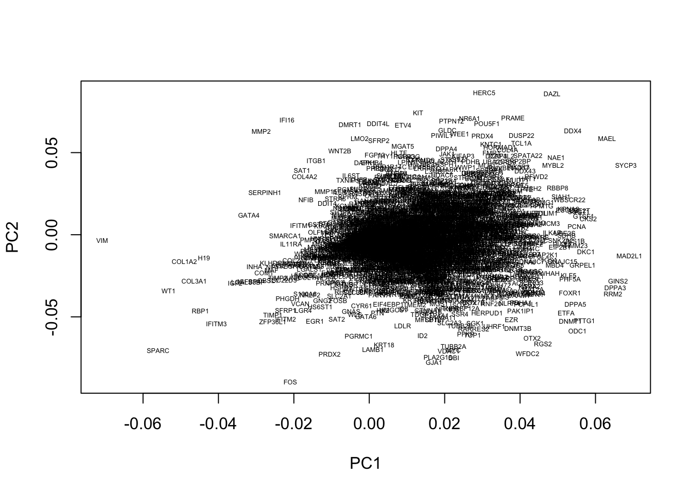

Okay, this plot is a little busy, so let's focus in on a particular region. Recall that PGCs seemed to lie towards the upper section of the plot (that is PC2 separated out PGCs from other cell types), so we'll take a look at the top section:


```r
plot(pcaresult$rotation[,1:2],type="n",xlim=c(-0.07, 0.07),ylim=c(0.04, 0.1))
genenames <- rownames(D)
genenames <- genenames[4:nrow(D)]
text(pcaresult$rotation[,1:2], genenames, cex = .4)
```

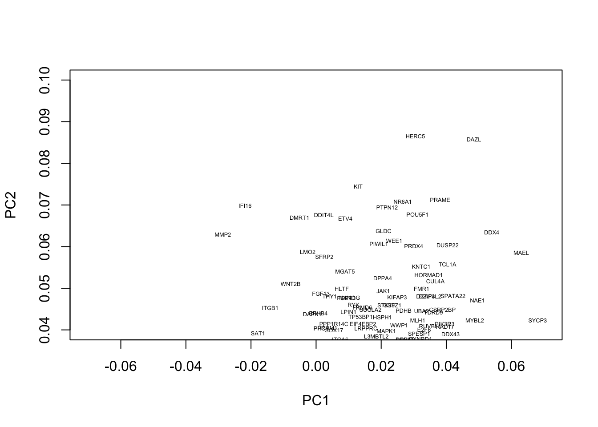

We now see a number of genes that are potentially associated with PGCs. These include a number of known PGCs, for example, both SOX17 and PRDM1 (which can be found at co-ordinates PC1=0, PC2= 0.04) represent two key specifiers of human PGC fate [@irie2015sox17,@tang2015unique,@kobayashi2017principles]. We further note a number of other key regulators, such as DAZL, have been implicated in germ cell development, with DAZL over expressed ESCs forming spermatogonia-like colonies in a rare instance upon xenotransplantation [@panula2016over].

We can similarly look at regions associated with early embryogenesis by concentrating on the lower half of the plot:


```r
plot(pcaresult$rotation[,1:2],type="n",xlim=c(0.0, 0.07),ylim=c(-0.07, -0.03))
genenames <- rownames(D)
genenames <- genenames[4:nrow(D)]
text(pcaresult$rotation[,1:2], genenames, cex = .4)
```

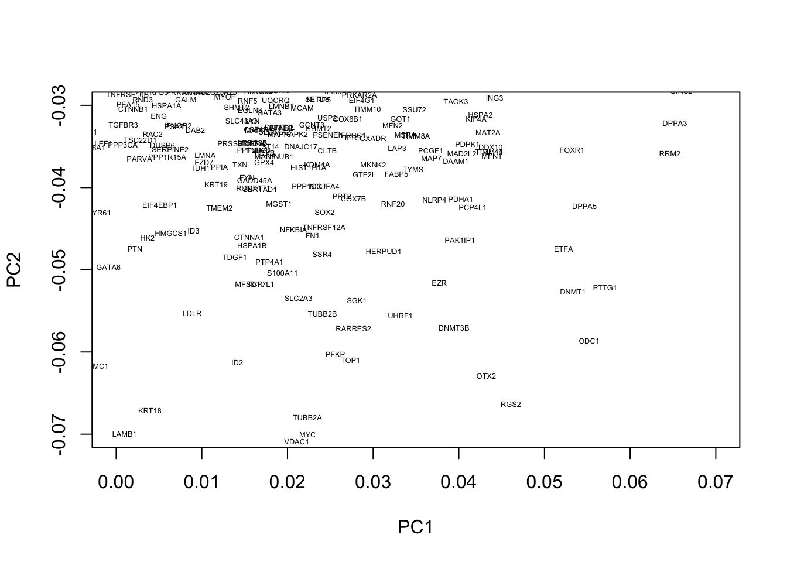

This appears to identify a number of genes associated with embryogenesis, for example, DPPA3, which encodes for a maternally inherited factor, Stella, required for normal pre-implantation development [@bortvin2004dppa3,@payer2003stella] as well as regulation of transcriptional and endogenous retrovirus programs during maternal-to-zygotic transition [@Huang2017stella].


## Nonlinear Dimensionality Reduction {#nonlinear-dimensionality-reduction}

Whilst [PCA]{#linear-dimensionality-reduction} is extremely useful for exploratory analysis, it is not always appropriate, particularly for datasets with nonlinearities. A large number of nonlinear dimensionality reduction techniques have therefore been developed. Perhaps the most commonly applied technique of the moment is t-distributed stochastic neighbour embedding (tSNE) [@maaten2008visualizing,@van2009learning,@van2012visualizing,@van2014accelerating].

In general, tSNE attempts to take points in a high-dimensional space and find a faithful representation of those points in a lower-dimensional space. The SNE algorithm initially converts the high-dimensional Euclidean distances between datapoints into conditional probabilities. Here $p_{j|i}$, indicates the probability that datapoint $x_i$ would pick $x_j$ as its neighbour if neighbours were picked in proportion to their probability density under a Gaussian centred at $x_i$:

$p_{j|i} = \frac{\exp(-|\mathbf{x}_i - \mathbf{x}_j|^2/2\sigma_i^2)}{\sum_{k\neq l}\exp(-|\mathbf{x}_k - \mathbf{x}_l|^2/2\sigma_i^2)}$

We can define a similar conditional probability for the datapoints in the reduced dimensional space, $y_j$ and $y_j$ as:

$q_{j|i} = \frac{\exp(-|\mathbf{y}_i - \mathbf{y}_j|^2)}{\sum_{k\neq l}\exp(-|\mathbf{y}_k - \mathbf{y}_l|^2)}$.

Natural extensions to this would instead use a Student-t distribution for the lower dimensional space:

$q_{j|i} = \frac{(1+|\mathbf{y}_i - \mathbf{y}_j|^2)^{-1}}{\sum_{k\neq l}(1+|\mathbf{y}_i - \mathbf{y}_j|^2)^{-1}}$.

If SNE has mapped points $\mathbf{y}_i$ and $\mathbf{y}_j$ faithfully, we have $p_{j|i} = q_{j|i}$. We can define a similarity measure over these distribution based on the Kullback-Leibler-divergence:

$C = \sum KL(P_i||Q_i)= \sum_i \sum_j p_{i|j} \log \biggl{(} \frac{p_{i|j}}{q_{i|j}} \biggr{)}$

If $p_{j|i} = q_{j|i}$, that is, if our reduced dimensionality representation faithfully captures the higher dimensional data, this value will be equal to zero, otherwise it will be a positive number. We can attempt to minimise this value using gradient descent.

Note that in many cases this lower dimensionality space can be initialised using PCA or other dimensionality reduction technique. The tSNE algorithm is implemented in R via the \texttt{Rtsne} package.


```r
library(Rtsne)
library(scatterplot3d)
set.seed(12345)
```

To get a feel for tSNE we will first generate some artificial data. In this case we generate two different groups that exist in a 3-dimensional space. We choose these groups to be Gaussian distributed, with different means and variances:


```r
D1 <- matrix( rnorm(5*3,mean=0,sd=1), 100, 3) 
D2 <- matrix( rnorm(5*3,mean=5,sd=3), 100, 3) 
G1 <- matrix( 1, 100, 1) 
G2 <- matrix( 2, 100, 1) 
D3 <- rbind(D1,D2)
G3 <- rbind(G1,G2)
colors <- c("red", "blue")
colors <- colors[G3]
scatterplot3d(D3,color=colors, main="3D Scatterplot",xlab="x",ylab="y",zlab="z")
```

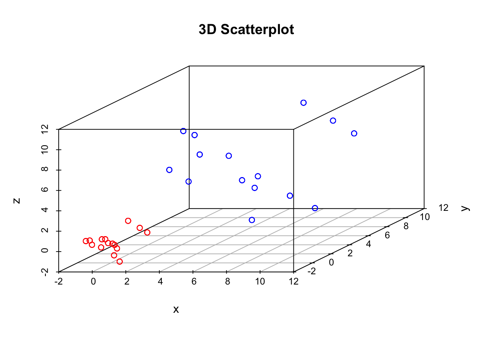

We can run tSNE on this dataset and try to condense the data down from a three-dimensional to a two-dimensional representation. Unlike PCA, which has no real free parameters, tSNE has a variety of parameters that need to be set. First, we have the perplexity parameter which, in essence, balances local and global aspects of the data. For low values of perplexity, the algorithm will tend to entirely focus on keeping datapoints locally together.


```r
tsne_model_1 <- Rtsne(as.matrix(D3), check_duplicates=FALSE, pca=TRUE, perplexity=10, theta=0.5, dims=2)
```

```
## Warning: In prcomp.default(X, retx = TRUE, center = pca_center, scale. = pca_scale, 
##     rank. = initial_dims) :
##  extra argument 'rank.' will be disregarded
```

```r
y1 <- tsne_model_1$Y[which(D[1,]==-1),1:2]
tsne_model_1 <- Rtsne(as.matrix(D3), check_duplicates=FALSE, pca=TRUE, perplexity=10, theta=0.5, dims=2)
```

```
## Warning: In prcomp.default(X, retx = TRUE, center = pca_center, scale. = pca_scale, 
##     rank. = initial_dims) :
##  extra argument 'rank.' will be disregarded
```

```r
plot(tsne_model_1$Y[1:100,1:2],type="p",col="red",xlim=c(-45, 45),ylim=c(-45, 45),xlab="tSNE1",ylab="tSNE1")
points(tsne_model_1$Y[101:200,1:2],type="p",col="blue")
```

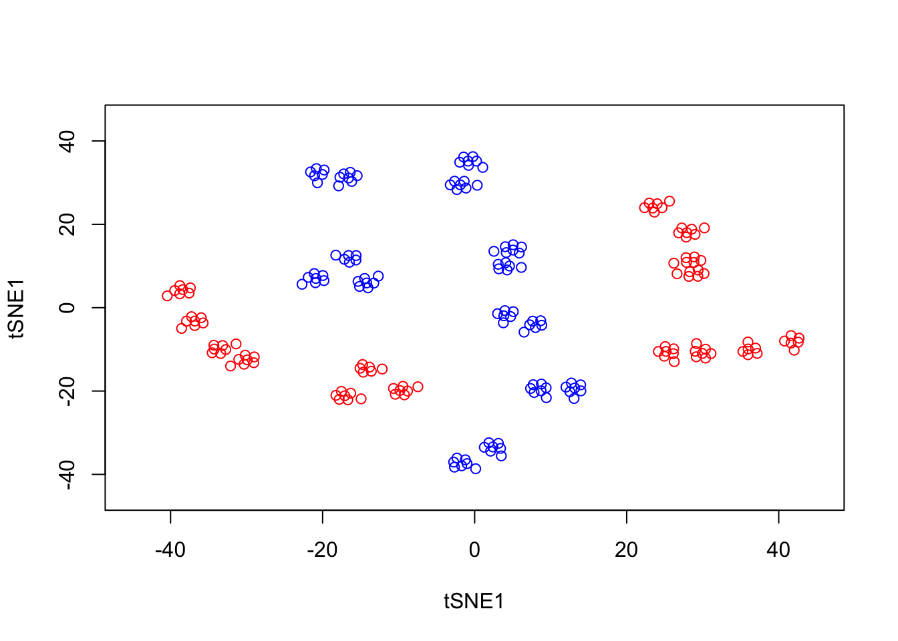

Note that here we have set the perplexity parameter reasonably low, and tSNE appears to have identified a lot of local structure that (we know) doesn't exist. Let's try again using a larger value for the perplexity parameter. 


```r
y1 <- tsne_model_1$Y[which(D[1,]==-1),1:2]
tsne_model_1 <- Rtsne(as.matrix(D3), check_duplicates=FALSE, pca=TRUE, perplexity=50, theta=0.5, dims=2)
```

```
## Warning: In prcomp.default(X, retx = TRUE, center = pca_center, scale. = pca_scale, 
##     rank. = initial_dims) :
##  extra argument 'rank.' will be disregarded
```

```r
plot(tsne_model_1$Y[1:100,1:2],type="p",col="red",xlim=c(-45, 45),ylim=c(-45, 45),xlab="tSNE1",ylab="tSNE2")
points(tsne_model_1$Y[101:200,1:2],type="p",col="blue")
```

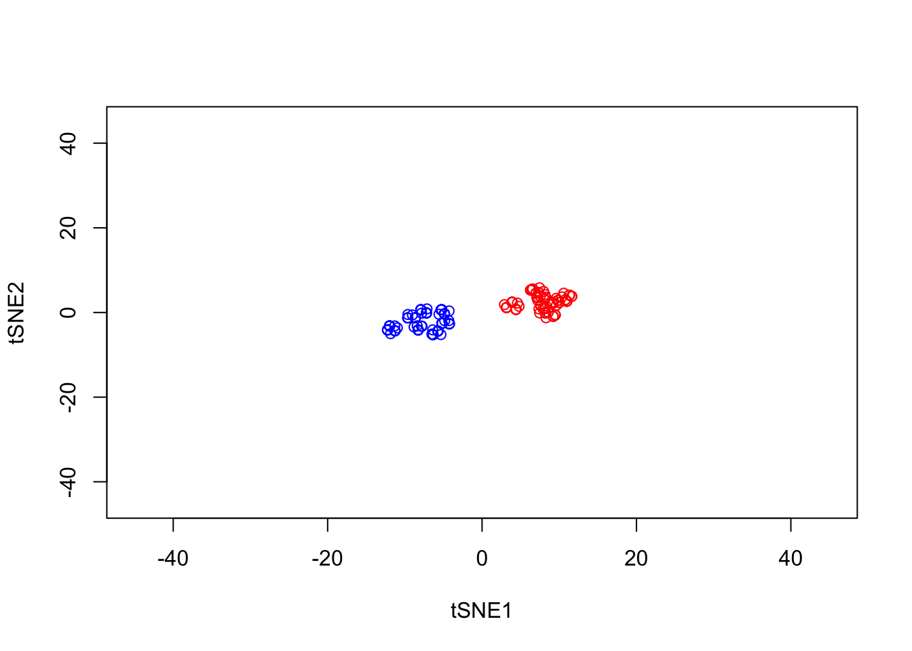

This appears to have done a better job of representing the data in a two-dimensional space. 
### Nonlinear warping 

In our previous example we showed that if the perplexity parameter was correctly set, tSNE seperated out the two populations very well. If we plot the original data next to the tSNE reduced dimensionality represention, however, we will notice something interesting:


```r
par(mfrow=c(1,2))
scatterplot3d(D3,color=colors, main="3D Scatterplot",xlab="x",ylab="y",zlab="z")
plot(tsne_model_1$Y[1:100,1:2],type="p",col="red",xlim=c(-45, 45),ylim=c(-45, 45),xlab="tSNE1", ylab="tSNE2")
points(tsne_model_1$Y[101:200,1:2],type="p",col="blue")
```

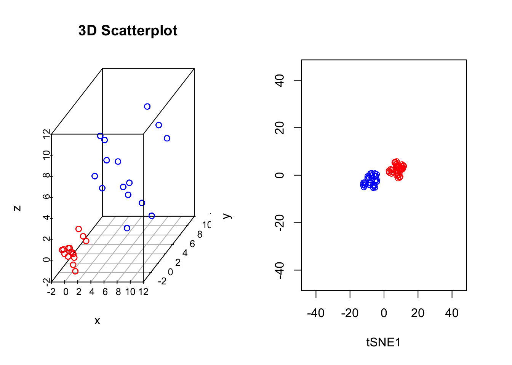

Whilst in the origianl data the two groups had very different variances, in the reduced dimensionality representation they appeared to show a similar spread. This is down to tSNEs ability to represent nonlinearities, and the algorithm performs different transformations on different regions. This is important to keep in mind: the spread in a tSNE output are not always indicative of the level of heterogeneity in the data.

### Stochasticity

A final important point to note is that tSNE is stochastic in nature. Unlike PCA which, for the same dataset, will always yield the same result, if you run tSNE twice you will likely find different results. We can illustrate this below, by running tSNE again for perplexity $30$, and plotting the results alongside the previous ones.


```r
set.seed(123456)

tsne_model_1 <- Rtsne(as.matrix(D3), check_duplicates=FALSE, pca=TRUE, perplexity=30, theta=0.5, dims=2)
```

```
## Warning: In prcomp.default(X, retx = TRUE, center = pca_center, scale. = pca_scale, 
##     rank. = initial_dims) :
##  extra argument 'rank.' will be disregarded
```

```r
tsne_model_2 <- Rtsne(as.matrix(D3), check_duplicates=FALSE, pca=TRUE, perplexity=30, theta=0.5, dims=2)
```

```
## Warning: In prcomp.default(X, retx = TRUE, center = pca_center, scale. = pca_scale, 
##     rank. = initial_dims) :
##  extra argument 'rank.' will be disregarded
```

```r
par(mfrow=c(1,2))
plot(tsne_model_1$Y[1:100,1:2],type="p",col="red",xlim=c(-45, 45),ylim=c(-45, 45),xlab="tSNE1",ylab="tSNE2")
points(tsne_model_1$Y[101:200,1:2],type="p",col="blue")

plot(tsne_model_2$Y[1:100,1:2],type="p",col="red",xlim=c(-45, 45),ylim=c(-45, 45),xlab="tSNE1",ylab="tSNE2")
points(tsne_model_2$Y[101:200,1:2],type="p",col="blue")
```

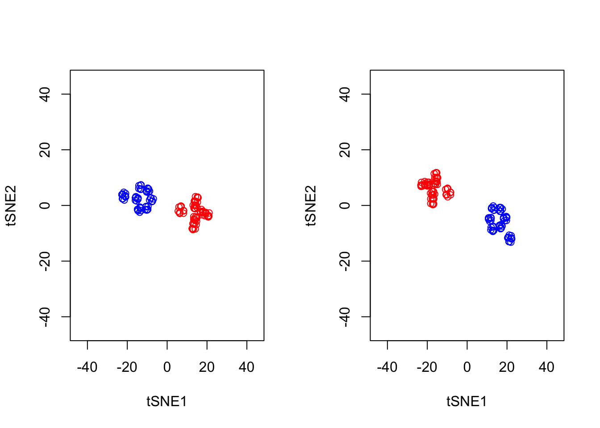

Note that this stochasticity, itself, may be a useful property, allowing us to gauge robustness of our biological interpretations. A comprehensive blog discussing the various pitfalls of tSNE is available [here](https://distill.pub/2016/misread-tsne/).

### Analysis of mammalian development

In earlier sections we used PCA to analyse scRNA-seq datasets of early human embryo development. In general PCA seemed adept at picking out different cell types and idetifying putative regulators associated with those cell types. We will now use tSNE to analyse the same data.

Excercise 2.5. Load in the single cell dataset and run tSNE. How do pre-implantation cells look in tSNE? 

Excercise 2.6. Note that cells labelled as pre-implantation actually consists of a variety of cells, from oocytes through to blastocyst stage. Take a look at the pre-implantation cells only using tSNE. Hint: a more refined categorisation of the developmental stage of pre-implantation cells can be found by looking at the developmental time variable (0=oocyte, 1=zygote, 2=2C, 3=4C, 4=8C, 5=Morula, 6=blastocyst). Try plotting the data from tSNE colouring the data according to developmental stage.


## Other dimensionality reduction techniques

A large number of alternative dimensionality reduction techniques exist with corresponding implementation in R. These include probabilistic extensions to PCA [pcaMethods](https://www.rdocumentation.org/packages/pcaMethods/versions/1.64.0), as well as other nonlinear dimensionality reduction techniques [Isomap](https://www.rdocumentation.org/packages/RDRToolbox/versions/1.22.0), as well as those based on Gaussian Processes ([GPLVM](https://github.com/SheffieldML/vargplvm.git); Lawrence 2004). Other packages such as [kernlab](https://cran.r-project.org/web/packages/kernlab/index.html) provide a general suite of tools for dimensionality reduction.

Solutions to exercises can be found in appendix \@ref(solutions-dimensionality-reduction).
