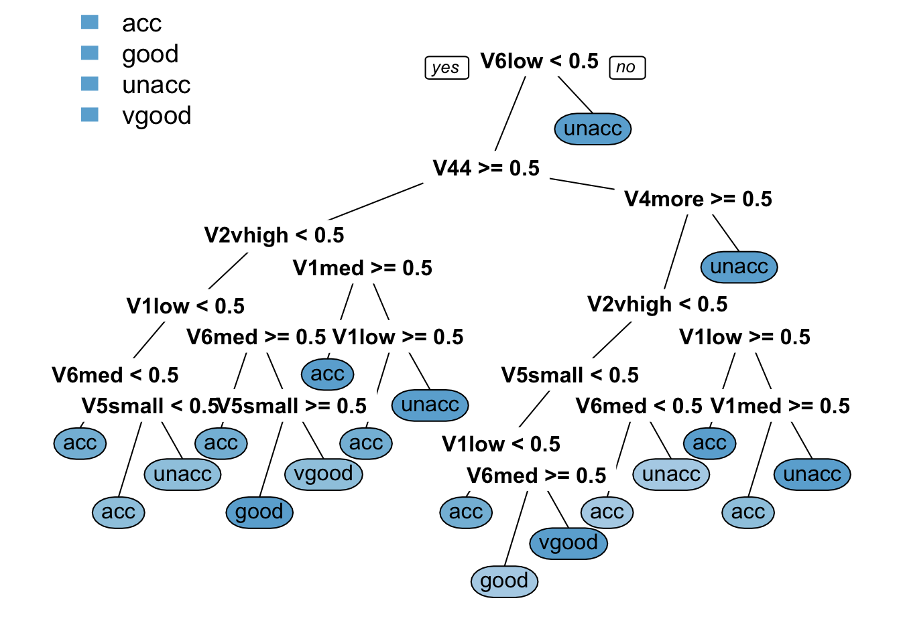
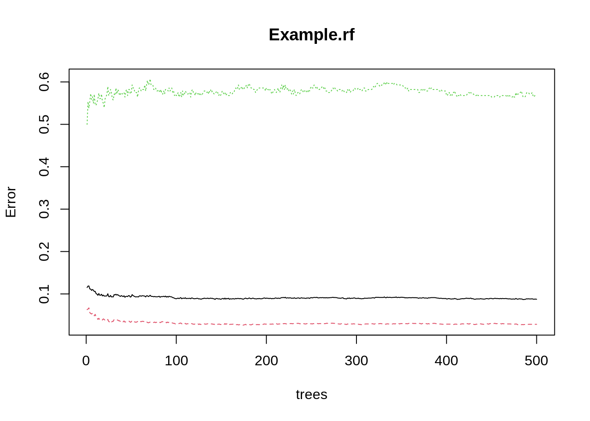
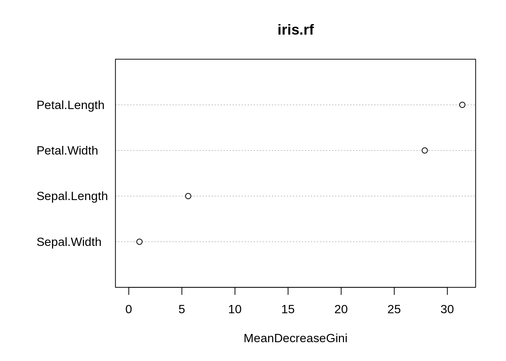

# Decision trees and random forests {#decision-trees}

<!-- Sudhakaran -->
## Decision Trees

**What is a Decision Tree?**

Decision tree or recursive partitioning is a supervised graph based algorithm to represent choices and the results of the choices in the form of a tree. 

The nodes in the graph represent an event or choice and it is referred to as a **leaf** and the set of *decisions* made at the node is reffered to as **branches**. 

Decision trees map non-linear relationships and the hierarchial leaves and branches makes a **Tree**. 

It is one of the most widely used tool in ML for predictive analytics. Examples of use of decision tress are − predicting an email as spam or not spam, predicting whether a tumor is cancerous or not.

<div class="figure" style="text-align: center">

<p class="caption">Decision Tree</p>
</div>
*Image source: analyticsvidhya.com*

**How does it work?**

A model is first created with training data and then a set of validation data is used to verify and improve the model. R has many packages, such as ctree, rpart, tree, and so on, which are used to create and visualize decision trees. 

<div class="figure" style="text-align: center">

<p class="caption">Example of a decision Tree</p>
</div>
*Image source: analyticsvidhya.com* 

**Example of a decision tree**\
In this problem (Figure 6.2), we need to segregate students who play cricket in their leisure time based on highly significant input variable among all three.

The decision tree algorithm will initially segregate the students based on **all values** of three variable (Gender, Class, and Height) and identify the variable, which creates the best homogeneous sets of students (which are heterogeneous to each other).

In the snapshot above, you can see that variable Gender is able to identify best homogeneous sets compared to the other two variables.

There are a number of decision tree algorithms. We have to choose them based on our dataset. If the dependent variable is categorical, then we have to use a *categorical variable decision tree*. If the dependent variable is continuous, then we have to use a *continuos variable deicsion tree*. 

The above example is of the categorical variable decision tree type. 

**A simple R code for decision tree looks like this:**

library(rpart)\
x <- cbind(x_train,y_train)\
# grow tree 
fit <- rpart(y_train ~ ., data = x,method="class")\
summary(fit)\
#Predict Output 
predicted= predict(fit,x_test)\

Where: 

y_train – represents dependent variable.\
x_train – represents independent variable\
x – represents training data.\


**Terminologies related to decision trees**

*Root nodule*: the entire population that can get further divided into homogenous sets

*Splitting*: process of diving a node into two or more sub-nodes

*Decision node*: When a sub-node splits into further sub-nodes

*Leaf or terminal node*: when a node does not split further it is called a terminal node. 

*Prunning*: A loose stopping crieteria is used to contruct the tree and then the tree is cut back by removing branches that do not contribute to the generalisation accuracy. 

*Branch*: a sub-section of an entire tree

**How does a tree decide where to split?**

The classification tree searches through each dependent variable to find a single variable that splits the data into two or more groups and this process is repeated until the stopping criteria is invoked. 

The decision of making strategic splits heavily affects a tree’s accuracy. The decision criteria is different for classification and regression trees.

Decision trees use multiple algorithms to decide to split a node in two or more sub-nodes. The common goal for these algorithms is the creation of sub-nodes with increased homogeneity. In other words, we can say that purity of the node increases with respect to the target variable. Decision tree splits the nodes on all available variables and then selects the split which results in most homogeneous sub-nodes.

**Commonly used algorithms to decide where to split**

**Gini Index**\
If we select two items from a population at random then they must be of same class and the probability for this is 1 if population is pure.

a. It works with categorical target variable “Success” or “Failure”.\
b. It performs only Binary splits\
c. Higher the value of Gini higher the homogeneity.\
d. CART (Classification and Regression Tree) uses Gini method to create binary splits.

Step 1: Calculate Gini for sub-nodes, using formula sum of square of probability for success and failure \ $$p^2+q^2$$.
Step 2: Calculate Gini for split using weighted Gini score of each node of that split.

**Chi-Square**\
It is an algorithm to find out the statistical significance between the differences between sub-nodes and parent node. We measure it by sum of squares of standardized differences between observed and expected frequencies of target variable.

a. It works with categorical target variable “Success” or “Failure”.
b. It can perform two or more splits.
c. Higher the value of Chi-Square higher the statistical significance of differences between sub-node and Parent node.
d. Chi-Square of each node is calculated using formula,
Chi-square = $$\sum(Actual – Expected)^2 / Expected$$

Steps to Calculate Chi-square for a split:

1. Calculate Chi-square for individual node by calculating the deviation for Success and Failure both
2. Calculated Chi-square of Split using Sum of all Chi-square of success and Failure of each node of the split

**Information Gain**\
The more homogenous something is the less information is needed to describe it and hence it has gained information. Information theory has a measure to define this degree of disorganization in a system and it is known as Entropy. If a sample is completely homogeneous, then the entropy is zero and if it is equally divided (50% – 50%), it has entropy of one.

Entropy can be calculated using formula
$$Entropy = -plog_2p - qlog_2q$$

Where p and q are probablity of success and failure

**Reduction in Variance**

Reduction in variance is an algorithm used for continuous target variables (regression problems). This algorithm uses the standard formula of variance to choose the best split. The split with lower variance is selected as the criteria to split the population:

**Advantages of decision tree**

1. Simple to understand and use\
2. Algorithms are robust to noisy data\
3. Useful in data exploration\
4. decision tree is 'non parametric' in nature i.e. does not have any assumptions about the distribution of the variables

**Disadvantages of decision tree** 

1.Overfitting is the common disadvantage of decision trees. It is taken care of partially by constraining the model parameter and by prunning.\
2. It is not ideal for continuous variables as in it looses information

*Some parameters used to defining a tree and constrain overfitting*

1. Minimum sample for a node split\
2. Minimum sample for a terminal node\
3. Maximum depth of a tree\
4. Maximum number of terminal nodes\
5. Maximum features considered for split

*Acknowledgement: some aspects of this explanation can be read from www.analyticsvidhya.com*

**Example code with categorical data**

We are going to plot a car evaulation data with 7 attributes, 6 as feature attributes and 1 as the target attribute. This is to evaluate what kinds of cars people purchase. All the attributes are categorical. We will try to build a classifier for predicting the Class attribute. The index of target attribute is 7th.

*instaling packages and downloading data*

R package *caret* helps to perform various machine learning tasks including decision tree classification. The *rplot.plot* package will help to get a visual plot of the decision tree.


```r
library(caret)
```

```
## Loading required package: lattice
```

```
## Loading required package: ggplot2
```

```r
library(rpart.plot)
```

```
## Loading required package: rpart
```

```r
data_url <- c("https://archive.ics.uci.edu/ml/machine-learning-databases/car/car.data")
download.file(url = data_url, destfile = "car.data")
 car_df <- read.csv("car.data", sep = ',', header = FALSE)
```


```r
 str(car_df)
```

```
## 'data.frame':	1728 obs. of  7 variables:
##  $ V1: chr  "vhigh" "vhigh" "vhigh" "vhigh" ...
##  $ V2: chr  "vhigh" "vhigh" "vhigh" "vhigh" ...
##  $ V3: chr  "2" "2" "2" "2" ...
##  $ V4: chr  "2" "2" "2" "2" ...
##  $ V5: chr  "small" "small" "small" "med" ...
##  $ V6: chr  "low" "med" "high" "low" ...
##  $ V7: chr  "unacc" "unacc" "unacc" "unacc" ...
```

The output of this will show us that our dataset consists of 1728 observations each with 7 attributes.


```r
head(car_df)
```

```
##      V1    V2 V3 V4    V5   V6    V7
## 1 vhigh vhigh  2  2 small  low unacc
## 2 vhigh vhigh  2  2 small  med unacc
## 3 vhigh vhigh  2  2 small high unacc
## 4 vhigh vhigh  2  2   med  low unacc
## 5 vhigh vhigh  2  2   med  med unacc
## 6 vhigh vhigh  2  2   med high unacc
```

All the features are categorical, so normalization of data is not needed.

*Data Slicing*

Data slicing is a step to split data into train and test set. Training data set can be used specifically for our model building. Test dataset should not be mixed up while building model. Even during standardization, we should not standardize our test set.


```r
set.seed(3033)
intrain <- createDataPartition(y = car_df$V7, p= 0.7, list = FALSE)
training <- car_df[intrain,]
testing <- car_df[-intrain,]
```

The “p” parameter holds a decimal value in the range of 0-1. It’s to show that percentage of the split. We are using p=0.7. It means that data split should be done in 70:30 ratio. 

*Data Preprocessing*


```r
#check dimensions of train & test set
dim(training); dim(testing);
```

```
## [1] 1211    7
```

```
## [1] 517   7
```


```r
anyNA(car_df)
```

```
## [1] FALSE
```


```r
summary(car_df)
```

```
##       V1                 V2                 V3                 V4           
##  Length:1728        Length:1728        Length:1728        Length:1728       
##  Class :character   Class :character   Class :character   Class :character  
##  Mode  :character   Mode  :character   Mode  :character   Mode  :character  
##       V5                 V6                 V7           
##  Length:1728        Length:1728        Length:1728       
##  Class :character   Class :character   Class :character  
##  Mode  :character   Mode  :character   Mode  :character
```

*Training the Decision Tree classifier with criterion as INFORMATION GAIN*


```r
trctrl <- trainControl(method = "repeatedcv", number = 10, repeats = 3)
set.seed(3333)
dtree_fit <- train(V7 ~., data = training, method = "rpart",
                   parms = list(split = "information"),
                   trControl=trctrl,
                   tuneLength = 10)
```

*Trained Decision Tree classifier results*


```r
dtree_fit 
```

```
## CART 
## 
## 1211 samples
##    6 predictor
##    4 classes: 'acc', 'good', 'unacc', 'vgood' 
## 
## No pre-processing
## Resampling: Cross-Validated (10 fold, repeated 3 times) 
## Summary of sample sizes: 1090, 1092, 1089, 1089, 1089, 1090, ... 
## Resampling results across tuning parameters:
## 
##   cp           Accuracy   Kappa    
##   0.005494505  0.8717704  0.7290692
##   0.007692308  0.8621260  0.7055343
##   0.008241758  0.8610377  0.7015747
##   0.010989011  0.8538908  0.6820370
##   0.016483516  0.8219632  0.6100808
##   0.018543956  0.8115194  0.5848871
##   0.019230769  0.8115194  0.5848871
##   0.024725275  0.8046066  0.5785861
##   0.060439560  0.7863800  0.5568316
##   0.070054945  0.7643436  0.4594143
## 
## Accuracy was used to select the optimal model using the largest value.
## The final value used for the model was cp = 0.005494505.
```
*Plotting the decision tress*


```r
prp(dtree_fit$finalModel, box.palette = "Reds", tweak = 1.2)
```


*Prediction* 

The model is trained with cp = 0.01123596. cp is complexity parameter for our dtree. We are ready to predict classes for our test set. We can use predict() method. Let’s try to predict target variable for test set’s 1st record.


```r
testing[1,]
```

```
##      V1    V2 V3 V4  V5   V6    V7
## 6 vhigh vhigh  2  2 med high unacc
```

```r
predict(dtree_fit, newdata = testing[1,])
```

```
## [1] unacc
## Levels: acc good unacc vgood
```

For our 1st record of testing data classifier is predicting class variable as “unacc”.  Now, its time to predict target variable for the whole test set.


```r
test_pred <- predict(dtree_fit, newdata = testing)
confusionMatrix(test_pred, as.factor(testing$V7) )  #check accuracy
```

```
## Confusion Matrix and Statistics
## 
##           Reference
## Prediction acc good unacc vgood
##      acc    94   14    28     3
##      good    3    5     0     2
##      unacc  17    0   335     0
##      vgood   1    1     0    14
## 
## Overall Statistics
##                                           
##                Accuracy : 0.8665          
##                  95% CI : (0.8342, 0.8947)
##     No Information Rate : 0.7021          
##     P-Value [Acc > NIR] : < 2.2e-16       
##                                           
##                   Kappa : 0.71            
##                                           
##  Mcnemar's Test P-Value : NA              
## 
## Statistics by Class:
## 
##                      Class: acc Class: good Class: unacc Class: vgood
## Sensitivity              0.8174    0.250000       0.9229      0.73684
## Specificity              0.8881    0.989940       0.8896      0.99598
## Pos Pred Value           0.6763    0.500000       0.9517      0.87500
## Neg Pred Value           0.9444    0.970414       0.8303      0.99002
## Prevalence               0.2224    0.038685       0.7021      0.03675
## Detection Rate           0.1818    0.009671       0.6480      0.02708
## Detection Prevalence     0.2689    0.019342       0.6809      0.03095
## Balanced Accuracy        0.8527    0.619970       0.9062      0.86641
```

The above results show that the classifier with the criterion as information gain is giving 83.72% of accuracy for the test set.

*Training the Decision Tree classifier with criterion as GINI INDEX*

Let’s try to program a decision tree classifier using splitting criterion as gini index. 


```r
set.seed(3333)
dtree_fit_gini <- train(V7 ~., data = training, method = "rpart",
                   parms = list(split = "gini"),
                   trControl=trctrl,
                   tuneLength = 10)
dtree_fit_gini
```

```
## CART 
## 
## 1211 samples
##    6 predictor
##    4 classes: 'acc', 'good', 'unacc', 'vgood' 
## 
## No pre-processing
## Resampling: Cross-Validated (10 fold, repeated 3 times) 
## Summary of sample sizes: 1090, 1092, 1089, 1089, 1089, 1090, ... 
## Resampling results across tuning parameters:
## 
##   cp           Accuracy   Kappa    
##   0.005494505  0.8725855  0.7315324
##   0.007692308  0.8654387  0.7134630
##   0.008241758  0.8648853  0.7122492
##   0.010989011  0.8637926  0.7082363
##   0.016483516  0.8376939  0.6465974
##   0.018543956  0.8189557  0.6043954
##   0.019230769  0.8164783  0.6001911
##   0.024725275  0.8082087  0.5862848
##   0.060439560  0.7935934  0.5696770
##   0.070054945  0.7442278  0.3266330
## 
## Accuracy was used to select the optimal model using the largest value.
## The final value used for the model was cp = 0.005494505.
```

It is showing us the accuracy metrics for different values of cp. 

*Plotting decision tree*


```r
prp(dtree_fit_gini$finalModel, box.palette = "Blues", tweak = 1.2)
```



*Prediction*

Our model is trained with cp = 0.01123596. Now, it’s time to predict target variable for the whole test set.


```r
test_pred_gini <- predict(dtree_fit_gini, newdata = testing)
confusionMatrix(test_pred_gini, as.factor(testing$V7) )  #check accuracy
```

```
## Confusion Matrix and Statistics
## 
##           Reference
## Prediction acc good unacc vgood
##      acc    95   10    29     6
##      good    6   10     1     7
##      unacc  13    0   333     0
##      vgood   1    0     0     6
## 
## Overall Statistics
##                                           
##                Accuracy : 0.8588          
##                  95% CI : (0.8258, 0.8877)
##     No Information Rate : 0.7021          
##     P-Value [Acc > NIR] : < 2.2e-16       
##                                           
##                   Kappa : 0.698           
##                                           
##  Mcnemar's Test P-Value : NA              
## 
## Statistics by Class:
## 
##                      Class: acc Class: good Class: unacc Class: vgood
## Sensitivity              0.8261     0.50000       0.9174      0.31579
## Specificity              0.8881     0.97183       0.9156      0.99799
## Pos Pred Value           0.6786     0.41667       0.9624      0.85714
## Neg Pred Value           0.9469     0.97972       0.8246      0.97451
## Prevalence               0.2224     0.03868       0.7021      0.03675
## Detection Rate           0.1838     0.01934       0.6441      0.01161
## Detection Prevalence     0.2708     0.04642       0.6692      0.01354
## Balanced Accuracy        0.8571     0.73592       0.9165      0.65689
```

The above results show that the classifier with the criterion as gini index is giving 86.05% of accuracy for the test set. In this case, our classifier with criterion gini index is giving better results.

*Acknowledgement: the above data comes from a machine learning database and the codes are discussed at*: http://dataaspirant.com/2017/02/03/decision-tree-classifier-implementation-in-r/ 

**Methods used in Decision Trees for trade-off balance**

*Ensemble methods* involve group of predictive models to achieve a better accuracy and model stability. Ensemble methods are known to impart supreme boost to tree based models.

*Bagging* is a technique used to reduce the variance of predictions by combining the result of multiple classifiers modeled on different sub-samples of the same data set. 

*Boosting* refers to a family of algorithms which converts weak learner to strong learner by combing the prediction of each weak learner using methods like average/ weighted average or by considering a prediction that has a higher vote. Gradient boosting and XGboost are examples of boosting algorithms. 

**Iris example for Decision Trees**

Even if we already know the classes for the 150 instances of irises, it could be interesting to create a model that predicts the species from the petal and sepal width and length. One model that is easy to create and understand is a decision tree, which can be created with the C5.0 package.


```r
if(!require(C50)){install.packages("C50")}
```

```
## Loading required package: C50
```

```r
library(C50)
input <- iris[,1:4]
output <- iris[,5]
model1 <- C5.0(input, output, control = C5.0Control(noGlobalPruning = TRUE,minCases=1))
summary(model1)
```

```
## 
## Call:
## C5.0.default(x = input, y = output, control = C5.0Control(noGlobalPruning
##  = TRUE, minCases = 1))
## 
## 
## C5.0 [Release 2.07 GPL Edition]  	Wed Oct  7 18:40:21 2020
## -------------------------------
## 
## Class specified by attribute `outcome'
## 
## Read 150 cases (5 attributes) from undefined.data
## 
## Decision tree:
## 
## Petal.Length <= 1.9: setosa (50)
## Petal.Length > 1.9:
## :...Petal.Width > 1.7: virginica (46/1)
##     Petal.Width <= 1.7:
##     :...Petal.Length <= 4.9: versicolor (48/1)
##         Petal.Length > 4.9:
##         :...Petal.Width <= 1.5: virginica (3)
##             Petal.Width > 1.5:
##             :...Petal.Length <= 5.4: versicolor (2)
##                 Petal.Length > 5.4: virginica (1)
## 
## 
## Evaluation on training data (150 cases):
## 
## 	    Decision Tree   
## 	  ----------------  
## 	  Size      Errors  
## 
## 	     6    2( 1.3%)   <<
## 
## 
## 	   (a)   (b)   (c)    <-classified as
## 	  ----  ----  ----
## 	    50                (a): class setosa
## 	          49     1    (b): class versicolor
## 	           1    49    (c): class virginica
## 
## 
## 	Attribute usage:
## 
## 	100.00%	Petal.Length
## 	 66.67%	Petal.Width
## 
## 
## Time: 0.0 secs
```

```r
plot(model1, main="C5.0 Decision Tree - Unpruned, min=1")
```


We can play with the parameters of the classifier to see better/simpler/more complete/more complex trees. Here's a simpler one:


```r
model2 <- C5.0(input, output, control = C5.0Control(noGlobalPruning = FALSE))
plot(model2, main="C5.0 Decision Tree - Pruned")
```


```r
plot(model2, type='simple')
```


```r
summary(model2)
```

```
## 
## Call:
## C5.0.default(x = input, y = output, control = C5.0Control(noGlobalPruning
##  = FALSE))
## 
## 
## C5.0 [Release 2.07 GPL Edition]  	Wed Oct  7 18:40:21 2020
## -------------------------------
## 
## Class specified by attribute `outcome'
## 
## Read 150 cases (5 attributes) from undefined.data
## 
## Decision tree:
## 
## Petal.Length <= 1.9: setosa (50)
## Petal.Length > 1.9:
## :...Petal.Width > 1.7: virginica (46/1)
##     Petal.Width <= 1.7:
##     :...Petal.Length <= 4.9: versicolor (48/1)
##         Petal.Length > 4.9: virginica (6/2)
## 
## 
## Evaluation on training data (150 cases):
## 
## 	    Decision Tree   
## 	  ----------------  
## 	  Size      Errors  
## 
## 	     4    4( 2.7%)   <<
## 
## 
## 	   (a)   (b)   (c)    <-classified as
## 	  ----  ----  ----
## 	    50                (a): class setosa
## 	          47     3    (b): class versicolor
## 	           1    49    (c): class virginica
## 
## 
## 	Attribute usage:
## 
## 	100.00%	Petal.Length
## 	 66.67%	Petal.Width
## 
## 
## Time: 0.0 secs
```

```r
#We can "zoom into" the usage of features for creation of the model:
C5imp(model2,metric='usage')
```

```
##              Overall
## Petal.Length  100.00
## Petal.Width    66.67
## Sepal.Length    0.00
## Sepal.Width     0.00
```

Now I have a model. Can we predict the class from the numerical attributes?

```r
newcases <- iris[c(1:3,51:53,101:103),]
newcases
```

```
##     Sepal.Length Sepal.Width Petal.Length Petal.Width    Species
## 1            5.1         3.5          1.4         0.2     setosa
## 2            4.9         3.0          1.4         0.2     setosa
## 3            4.7         3.2          1.3         0.2     setosa
## 51           7.0         3.2          4.7         1.4 versicolor
## 52           6.4         3.2          4.5         1.5 versicolor
## 53           6.9         3.1          4.9         1.5 versicolor
## 101          6.3         3.3          6.0         2.5  virginica
## 102          5.8         2.7          5.1         1.9  virginica
## 103          7.1         3.0          5.9         2.1  virginica
```

```r
predicted <- predict(model2, newcases, type="class")
predicted
```

```
## [1] setosa     setosa     setosa     versicolor versicolor versicolor virginica 
## [8] virginica  virginica 
## Levels: setosa versicolor virginica
```

## Random Forest

**What is a Random Forest?**

It is a kind of ensemble learning method that combines a set of weak models to form a powerful model. In the process it reduces dimensionality, removes outliers, treats missing values, and more importantly it is both a regression and classification machine learning approach. 

**How does it work?**

In Random Forest, multiple trees are grown as opposed to a single tree in a decision tree model. Assume number of cases in the training set is N. Then, sample of these N cases is taken at random but with replacement. This sample will be the training set for growing the tree. Each tree is grown to the largest extent possible and without pruning.

To classify a new object based on attributes, each tree gives a classification i.e. “votes” for that class. The forest chooses the classification having the most votes (over all the trees in the forest) and in case of regression, it takes the average of outputs by different trees.

**Key differences between decision trees and random forest**

Decision trees proceed by searching for a split on every variable in every node random forest searches for a split only on one variable in a node -  the variable that has the largest association with the target among all other explanatory variables but only on a subset of randomly selected explanatory variables that is tested for that node. At every node a new list is selected. 

Therefore, eligible variable set will be different from node to node but the important ones will eventually be "voted in" based on their success in predicting the targert variable. 

This random selection of explanatory variables at each node and which are different at each treee is known as bagging. For each tree the ratio between bagging and out of bagging is 60/40. 

The important thing to note is that the trees are themselves not intpreted but they are used to collectively rank the importance of each variable. 

**Example Random Forest code for binary classification**

In this example, a bank wanted to cross-sell term deposit product to its customers and hence it wanted to build a predictive model, which will identify customers who are more likely to respond to term deport cross-sell campaign.

*Install and load randomForest library*


```r
# Load library
library(randomForest)
```

```
## randomForest 4.6-14
```

```
## Type rfNews() to see new features/changes/bug fixes.
```

```
## 
## Attaching package: 'randomForest'
```

```
## The following object is masked from 'package:ggplot2':
## 
##     margin
```


```r
## Read data
Example<-read.csv(file="data/Decision_tree_and_RF/bank.csv",header = T)
Example$y = as.factor(Example$y)
```

Input dataset has 20 independent variables and a target variable. The target variable y is binary.


```r
names(Example)
```

```
##  [1] "age"            "job"            "marital"        "education"     
##  [5] "default"        "housing"        "loan"           "contact"       
##  [9] "month"          "day_of_week"    "duration"       "campaign"      
## [13] "pdays"          "previous"       "poutcome"       "emp.var.rate"  
## [17] "cons.price.idx" "cons.conf.idx"  "euribor3m"      "nr.employed"   
## [21] "y"
```


```r
table(Example$y)/nrow(Example)
```

```
## 
##        no       yes 
## 0.8905074 0.1094926
```

11% of the observations has target variable “yes” and remaining 89% observations take value “no”.

We will split the data sample into development and validation samples.


```r
sample.ind <- sample(2, 
                     nrow(Example),
                     replace = T,
                     prob = c(0.6,0.4))
Example.dev <- Example[sample.ind==1,]
Example.val <- Example[sample.ind==2,]

table(Example.dev$y)/nrow(Example.dev)
```

```
## 
##        no       yes 
## 0.8897638 0.1102362
```
Both development and validation samples have similar target variable distribution. This is just a sample validation.


```r
class(Example.dev$y)
```

```
## [1] "factor"
```
Class of target or response variable is factor, so a classification Random Forest will be built. The current data frame has a list of independent variables, so we can make it formula and then pass as a parameter value for randomForest.


*Make Formula*


```r
varNames <- names(Example.dev)
# Exclude ID or Response variable
varNames <- varNames[!varNames %in% c("y")]

# add + sign between exploratory variables
varNames1 <- paste(varNames, collapse = "+")

# Add response variable and convert to a formula object
rf.form <- as.formula(paste("y", varNames1, sep = " ~ "))
```


*Building Random Forest model*

We will build 500 decision trees using Random Forest.


```r
Example.rf <- randomForest(rf.form,
                              Example.dev,
                              ntree=500,
                              importance=T)

plot(Example.rf)
```



500 decision trees or a forest has been built using the Random Forest algorithm based learning. We can plot the error rate across decision trees. The plot seems to indicate that after 100 decision trees, there is not a significant reduction in error rate.


```r
# Variable Importance Plot
varImpPlot(Example.rf,
           sort = T,
           main="Variable Importance",
           n.var=5)
```


Variable importance plot is also a useful tool and can be plotted using varImpPlot function. Top 5 variables are selected and plotted based on Model Accuracy and Gini value. We can also get a table with decreasing order of importance based on a measure (1 for model accuracy and 2 node impurity)


```r
# Variable Importance Table
var.imp <- data.frame(importance(Example.rf,
           type=2))
# make row names as columns
var.imp$Variables <- row.names(var.imp)
var.imp[order(var.imp$MeanDecreaseGini,decreasing = T),]
```

```
##                MeanDecreaseGini      Variables
## duration             143.966515       duration
## euribor3m             57.510569      euribor3m
## nr.employed           38.438332    nr.employed
## age                   37.305513            age
## job                   22.169214            job
## pdays                 18.926765          pdays
## cons.conf.idx         18.455165  cons.conf.idx
## education             17.801930      education
## day_of_week           17.381769    day_of_week
## campaign              16.475563       campaign
## cons.price.idx        15.922234 cons.price.idx
## poutcome              14.271728       poutcome
## emp.var.rate          14.150449   emp.var.rate
## month                 12.866756          month
## marital                9.775724        marital
## previous               8.943332       previous
## housing                8.624434        housing
## loan                   5.669661           loan
## contact                5.430161        contact
## default                3.978805        default
```

Based on Random Forest variable importance, the variables could be selected for any other predictive modelling techniques or machine learning.

*Predict Response Variable Value using Random Forest*

Generic predict function can be used for predicting response variable using Random Forest object.


```r
# Predicting response variable
Example.dev$predicted.response <- predict(Example.rf ,Example.dev)
```


confusionMatrix function from caret package can be used for creating confusion matrix based on actual response variable and predicted value.


```r
# Load Library or packages
library(e1071)
library(caret)
## Loading required package: lattice
## Loading required package: ggplot2
# Create Confusion Matrix
confusionMatrix(data=Example.dev$predicted.response,
                reference=Example.dev$y,
                positive='yes')
```

```
## Confusion Matrix and Statistics
## 
##           Reference
## Prediction   no  yes
##        no  2260    1
##        yes    0  279
##                                      
##                Accuracy : 0.9996     
##                  95% CI : (0.9978, 1)
##     No Information Rate : 0.8898     
##     P-Value [Acc > NIR] : <2e-16     
##                                      
##                   Kappa : 0.998      
##                                      
##  Mcnemar's Test P-Value : 1          
##                                      
##             Sensitivity : 0.9964     
##             Specificity : 1.0000     
##          Pos Pred Value : 1.0000     
##          Neg Pred Value : 0.9996     
##              Prevalence : 0.1102     
##          Detection Rate : 0.1098     
##    Detection Prevalence : 0.1098     
##       Balanced Accuracy : 0.9982     
##                                      
##        'Positive' Class : yes        
## 
```

It has accuracy of 99.81%. Now we can predict response for the validation sample and calculate model accuracy for the sample.


```r
# Predicting response variable
Example.val$predicted.response <- predict(Example.rf ,Example.val)

# Create Confusion Matrix
confusionMatrix(data=Example.val$predicted.response,
                reference=Example.val$y,
                positive='yes')
```

```
## Confusion Matrix and Statistics
## 
##           Reference
## Prediction   no  yes
##        no  1356   97
##        yes   52   74
##                                           
##                Accuracy : 0.9056          
##                  95% CI : (0.8901, 0.9196)
##     No Information Rate : 0.8917          
##     P-Value [Acc > NIR] : 0.0388508       
##                                           
##                   Kappa : 0.4476          
##                                           
##  Mcnemar's Test P-Value : 0.0003126       
##                                           
##             Sensitivity : 0.43275         
##             Specificity : 0.96307         
##          Pos Pred Value : 0.58730         
##          Neg Pred Value : 0.93324         
##              Prevalence : 0.10830         
##          Detection Rate : 0.04687         
##    Detection Prevalence : 0.07980         
##       Balanced Accuracy : 0.69791         
##                                           
##        'Positive' Class : yes             
## 
```
Accuracy level has dropped to 91.8% but still significantly higher. 

**Iris data example**


```r
library(randomForest)
ind <- sample(2,nrow(iris),replace=TRUE,prob=c(0.7,0.3))
trainData <- iris[ind==1,]
testData <- iris[ind==2,]
iris.rf <- randomForest(Species~.,data=trainData,ntree=100,proximity=TRUE)
table(predict(iris.rf),trainData$Species)
```

```
##             
##              setosa versicolor virginica
##   setosa         31          0         0
##   versicolor      0         31         3
##   virginica       0          1        34
```

```r
print(iris.rf)
```

```
## 
## Call:
##  randomForest(formula = Species ~ ., data = trainData, ntree = 100,      proximity = TRUE) 
##                Type of random forest: classification
##                      Number of trees: 100
## No. of variables tried at each split: 2
## 
##         OOB estimate of  error rate: 4%
## Confusion matrix:
##            setosa versicolor virginica class.error
## setosa         31          0         0  0.00000000
## versicolor      0         31         1  0.03125000
## virginica       0          3        34  0.08108108
```

```r
#plot(iris.rf)
importance(iris.rf)
```

```
##              MeanDecreaseGini
## Sepal.Length         5.596558
## Sepal.Width          1.005828
## Petal.Length        31.407250
## Petal.Width         27.870964
```

```r
varImpPlot(iris.rf)
```



```r
iris.pred<-predict(iris.rf,newdata=testData)
table(iris.pred, testData$Species)
```

```
##             
## iris.pred    setosa versicolor virginica
##   setosa         19          0         0
##   versicolor      0         15         0
##   virginica       0          3        13
```

As observed for the previous examples, the discriminative features are the petal length and the petal width.


*Acknowledgement: the above data is from a machine-learning database and the code is discusses*: http://dni-institute.in/blogs/random-forest-using-r-step-by-step-tutorial/*

## Exercises

**Titanic Data**\ 
One of the reasons that the shipwreck led to such loss of life was that there were not enough lifeboats for the passengers and crew. Although there was some element of luck involved in surviving the sinking, some groups of people were more likely to survive than others, such as women, children, and the upper-class.

In this excerise, try to complete the analysis of what sorts of people were likely to survive. The data can be downloaded from https://goo.gl/At238b. Hint: Use decision tree.   

Solutions to exercises can be found in appendix \@ref(solutions-decision-trees).
