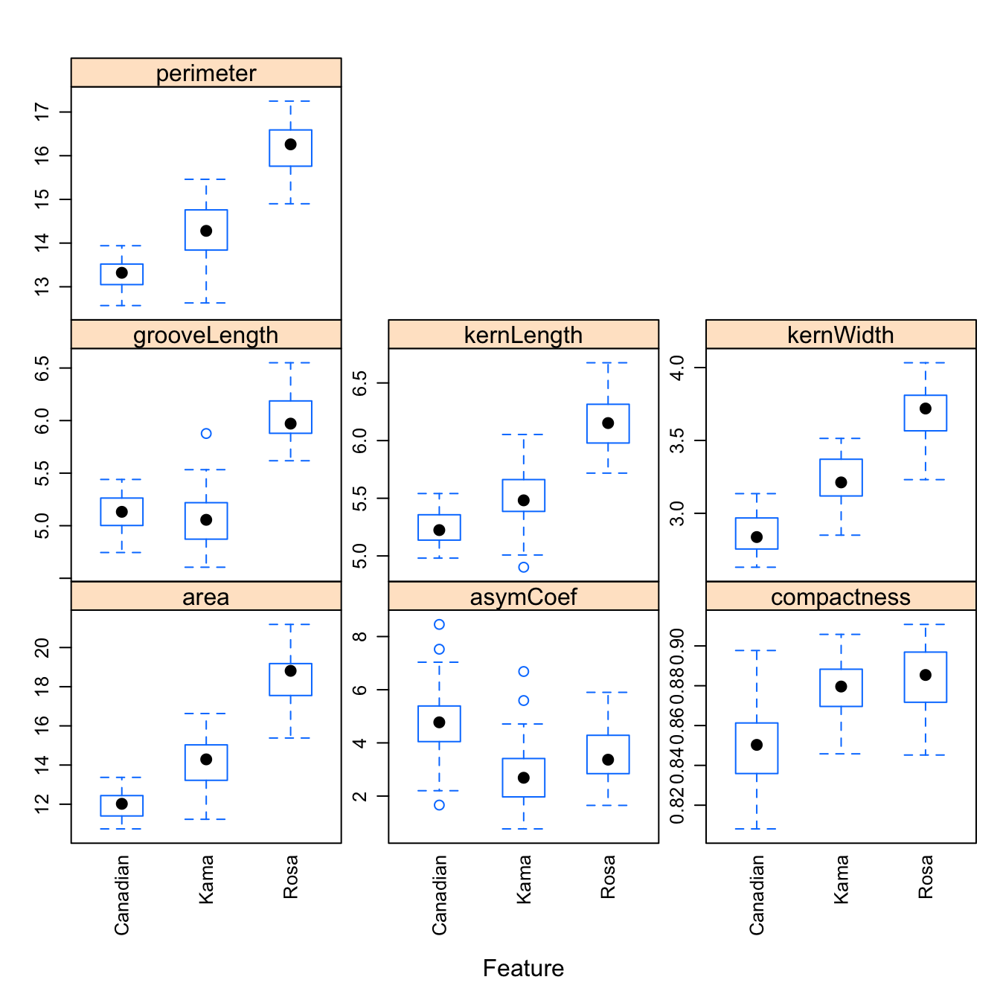
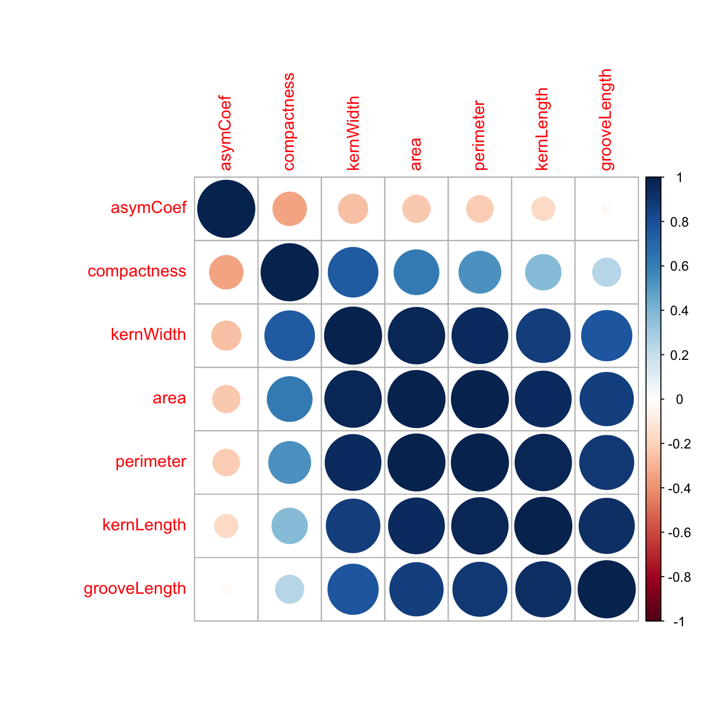
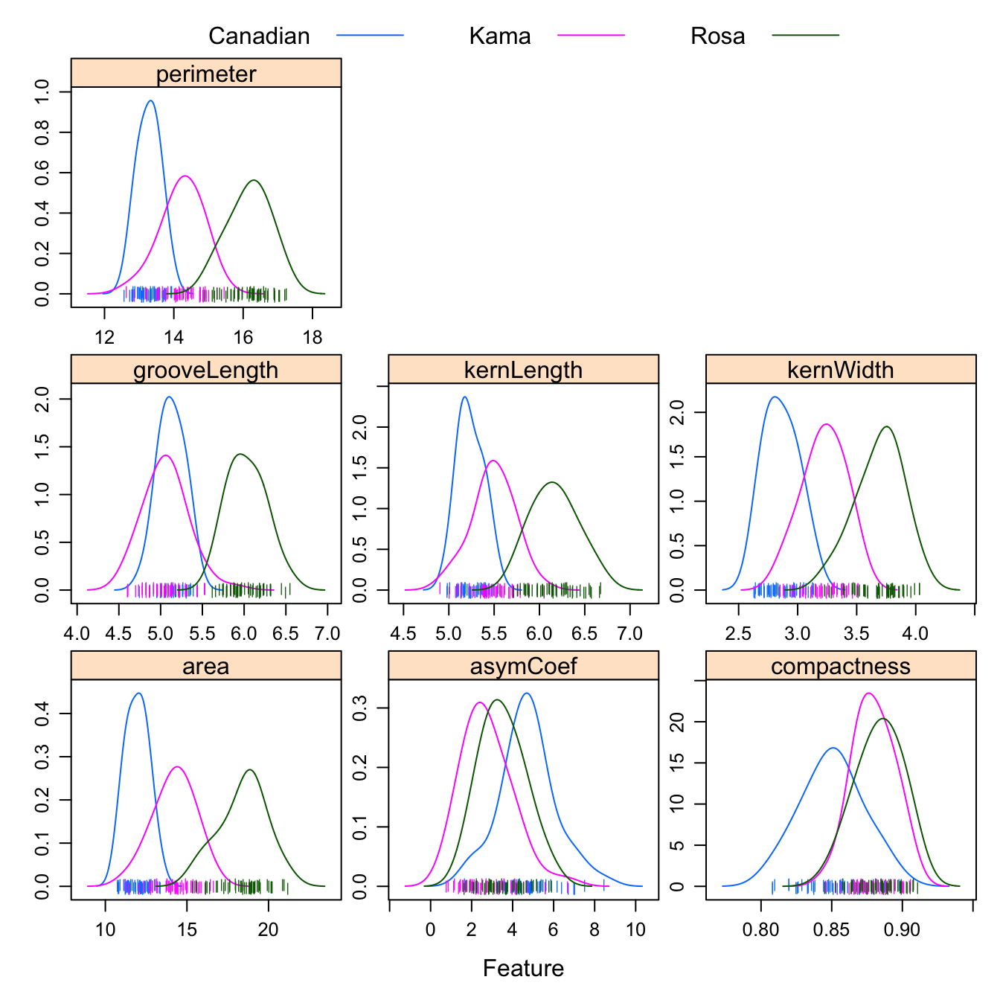
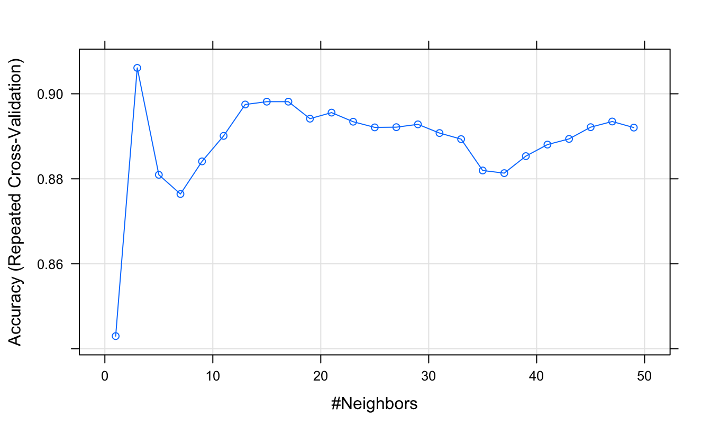

# Solutions ch. 7 - Nearest neighbours {#solutions-nearest-neighbours}

Solutions to exercises of chapter \@ref(nearest-neighbours).

## Exercise 1

Load libraries

```r
library(caret)
```

```
## Loading required package: lattice
```

```
## Loading required package: ggplot2
```

```r
library(RColorBrewer)
library(doMC)
```

```
## Loading required package: foreach
```

```
## Loading required package: iterators
```

```
## Loading required package: parallel
```

```r
library(corrplot)
```

```
## corrplot 0.84 loaded
```

Prepare for parallel processing

```r
registerDoMC(detectCores())
```

Load data

```r
load("data/wheat_seeds/wheat_seeds.Rda")
```

Partition data

```r
set.seed(42)
trainIndex <- createDataPartition(y=variety, times=1, p=0.7, list=F)
varietyTrain <- variety[trainIndex]
morphTrain <- morphometrics[trainIndex,]
varietyTest <- variety[-trainIndex]
morphTest <- morphometrics[-trainIndex,]

summary(varietyTrain)
```

```
## Canadian     Kama     Rosa 
##       49       49       49
```

```r
summary(varietyTest)
```

```
## Canadian     Kama     Rosa 
##       21       21       21
```

Data check: zero and near-zero predictors

```r
nzv <- nearZeroVar(morphTrain, saveMetrics=T)
nzv
```

```
##              freqRatio percentUnique zeroVar   nzv
## area          1.500000      95.91837   FALSE FALSE
## perimeter     1.333333      86.39456   FALSE FALSE
## compactness   1.000000      91.83673   FALSE FALSE
## kernLength    1.000000      91.15646   FALSE FALSE
## kernWidth     1.000000      91.83673   FALSE FALSE
## asymCoef      2.000000      99.31973   FALSE FALSE
## grooveLength  1.333333      76.19048   FALSE FALSE
```

Data check: are all predictors on same scale?

```r
summary(morphTrain)
```

```
##       area         perimeter      compactness       kernLength   
##  Min.   :10.59   Min.   :12.41   Min.   :0.8081   Min.   :4.899  
##  1st Qu.:12.34   1st Qu.:13.46   1st Qu.:0.8577   1st Qu.:5.264  
##  Median :14.46   Median :14.40   Median :0.8734   Median :5.541  
##  Mean   :14.87   Mean   :14.56   Mean   :0.8724   Mean   :5.624  
##  3rd Qu.:17.10   3rd Qu.:15.65   3rd Qu.:0.8881   3rd Qu.:5.979  
##  Max.   :20.97   Max.   :17.25   Max.   :0.9153   Max.   :6.675  
##    kernWidth        asymCoef      grooveLength  
##  Min.   :2.630   Min.   :0.903   Min.   :4.519  
##  1st Qu.:2.958   1st Qu.:2.372   1st Qu.:5.046  
##  Median :3.259   Median :3.597   Median :5.222  
##  Mean   :3.267   Mean   :3.659   Mean   :5.406  
##  3rd Qu.:3.557   3rd Qu.:4.799   3rd Qu.:5.862  
##  Max.   :4.032   Max.   :8.456   Max.   :6.550
```


```r
featurePlot(x = morphTrain, 
            y = varietyTrain, 
            plot = "box", 
            ## Pass in options to bwplot() 
            scales = list(y = list(relation="free"),
                          x = list(rot = 90)),  
            layout = c(3,3))
```

<div class="figure" style="text-align: center">

<p class="caption">Boxplots of the 7 geometric parameters in the wheat data set</p>
</div>

Data check: pairwise correlations between predictors

```r
corMat <- cor(morphTrain)
corrplot(corMat, order="hclust", tl.cex=1)
```

<div class="figure" style="text-align: center">

<p class="caption">Correlogram of the wheat seed data set.</p>
</div>


```r
highCorr <- findCorrelation(corMat, cutoff=0.75)
length(highCorr)
```

```
## [1] 4
```

```r
names(morphTrain)[highCorr]
```

```
## [1] "area"       "perimeter"  "kernWidth"  "kernLength"
```

Data check: skewness

```r
featurePlot(x = morphTrain, 
            y = varietyTrain,
            plot = "density", 
            ## Pass in options to xyplot() to 
            ## make it prettier
            scales = list(x = list(relation="free"), 
                          y = list(relation="free")), 
            adjust = 1.5, 
            pch = "|", 
            layout = c(3, 3), 
            auto.key = list(columns = 3))
```

<div class="figure" style="text-align: center">

<p class="caption">Density plots of the 7 geometric parameters in the wheat data set</p>
</div>
            
Create a 'grid' of values of _k_ for evaluation:

```r
tuneParam <- data.frame(k=seq(1,50,2))
```
            
Generate a list of seeds for reproducibility (optional) based on grid size

```r
set.seed(42)
seeds <- vector(mode = "list", length = 101)
for(i in 1:100) seeds[[i]] <- sample.int(1000, length(tuneParam$k))
seeds[[101]] <- sample.int(1000,1)
```

<!--
Define a pre-processor (named transformations) and transform morphTrain

```r
transformations <- preProcess(morphTrain, 
                              method=c("center", "scale", "corr"),
                              cutoff=0.75)
morphTrainT <- predict(transformations, morphTrain)
```
-->

Set training parameters. In the example in chapter \@ref(nearest-neighbours) pre-processing was performed outside the cross-validation process to save time for the purposes of the demonstration. Here we have a relatively small data set, so we can do pre-processing within each iteration of the cross-validation process. We specify the option  ```preProcOptions=list(cutoff=0.75)``` to set a value for the pairwise correlation coefficient cutoff.

```r
train_ctrl <- trainControl(method="repeatedcv",
                   number = 10,
                   repeats = 10,
                   preProcOptions=list(cutoff=0.75),
                   seeds = seeds)
```

Run training

```r
knnFit <- train(morphTrain, varietyTrain, 
                method="knn",
                preProcess = c("center", "scale", "corr"),
                tuneGrid=tuneParam,
                trControl=train_ctrl)
knnFit
```

```
## k-Nearest Neighbors 
## 
## 147 samples
##   7 predictor
##   3 classes: 'Canadian', 'Kama', 'Rosa' 
## 
## Pre-processing: centered (7), scaled (7) 
## Resampling: Cross-Validated (10 fold, repeated 10 times) 
## Summary of sample sizes: 133, 132, 133, 132, 132, 133, ... 
## Resampling results across tuning parameters:
## 
##   k   Accuracy   Kappa    
##    1  0.9172381  0.8756147
##    3  0.9030000  0.8542882
##    5  0.8975238  0.8461304
##    7  0.8995238  0.8491221
##    9  0.8927143  0.8389243
##   11  0.8974286  0.8459930
##   13  0.8940000  0.8408394
##   15  0.8906667  0.8358560
##   17  0.8986667  0.8478807
##   19  0.9055238  0.8581482
##   21  0.8994286  0.8490026
##   23  0.8954286  0.8430026
##   25  0.8948095  0.8420544
##   27  0.8968095  0.8450950
##   29  0.8921429  0.8381116
##   31  0.8873810  0.8309740
##   33  0.8825714  0.8237096
##   35  0.8893810  0.8339577
##   37  0.8907143  0.8360068
##   39  0.8906667  0.8358971
##   41  0.8927619  0.8390021
##   43  0.8941429  0.8410779
##   45  0.8934286  0.8399857
##   47  0.8975238  0.8461885
##   49  0.8961429  0.8441033
## 
## Accuracy was used to select the optimal model using the largest value.
## The final value used for the model was k = 1.
```

Plot cross validation accuracy as a function of _k_

```r
plot(knnFit)
```

<div class="figure" style="text-align: center">

<p class="caption">Accuracy (repeated cross-validation) as a function of neighbourhood size for the wheat seeds data set.</p>
</div>

Predict the class (wheat variety) of the observations in the test set.

```r
test_pred <- predict(knnFit, morphTest)
confusionMatrix(test_pred, varietyTest)
```

```
## Confusion Matrix and Statistics
## 
##           Reference
## Prediction Canadian Kama Rosa
##   Canadian       21    3    0
##   Kama            0   17    0
##   Rosa            0    1   21
## 
## Overall Statistics
##                                           
##                Accuracy : 0.9365          
##                  95% CI : (0.8453, 0.9824)
##     No Information Rate : 0.3333          
##     P-Value [Acc > NIR] : < 2.2e-16       
##                                           
##                   Kappa : 0.9048          
##                                           
##  Mcnemar's Test P-Value : NA              
## 
## Statistics by Class:
## 
##                      Class: Canadian Class: Kama Class: Rosa
## Sensitivity                   1.0000      0.8095      1.0000
## Specificity                   0.9286      1.0000      0.9762
## Pos Pred Value                0.8750      1.0000      0.9545
## Neg Pred Value                1.0000      0.9130      1.0000
## Prevalence                    0.3333      0.3333      0.3333
## Detection Rate                0.3333      0.2698      0.3333
## Detection Prevalence          0.3810      0.2698      0.3492
## Balanced Accuracy             0.9643      0.9048      0.9881
```


